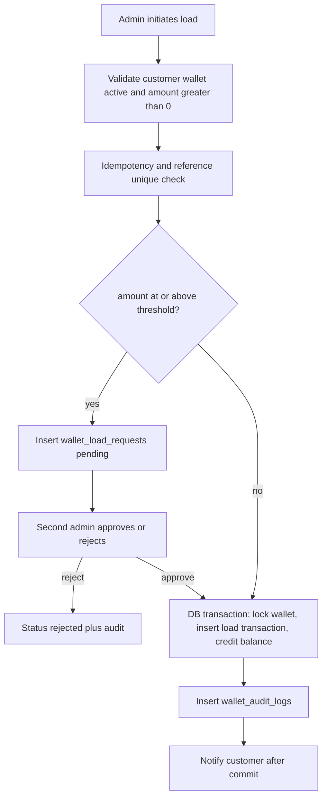
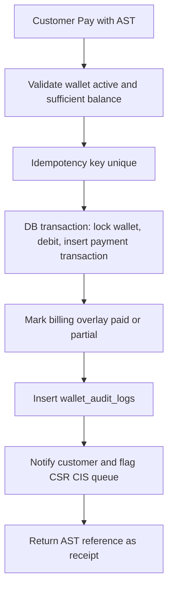

# AST wallet — Phase 1 architecture

Closed-loop internal credit. **1 AST = ₱1** (`config/ast.php` → `php_per_ast`, env `AST_PHP_RATE`). Not cash, not withdrawable, not transferable between customers. Change the rate only after an explicit product decision.

`customer_id` is `users.id` (there is no separate customers table). One wallet per member. A member with several electric accounts still has **one** AST balance.

The earlier `ast_wallets` / `ast_ledger_entries` / `ast_audit_logs` tables were a first pass. **These four tables are the Phase 1 contract.** Phase 2 controllers should use `Wallet`, `WalletTransaction`, `WalletLoadRequest`, and `WalletAuditLog` — do not add a second money path.

---

## Tables

| Table | Purpose |
|---|---|
| `wallets` | One row per `customer_id`. `balance >= 0` (CHECK). Status: `active` / `frozen` / `closed`. |
| `wallet_transactions` | Append-only money log. `reference_no` UNIQUE, `idempotency_key` UNIQUE, `amount > 0`, `balance_after >= 0`. Types: `load` / `payment` / `reversal` / `adjustment`. |
| `wallet_load_requests` | Maker-checker queue for loads at or above `AST_LOAD_APPROVAL_THRESHOLD` (default **10,000 AST**). |
| `wallet_audit_logs` | Who / what / before / after / IP / UA. Never update or delete. |

Migrations:

- `database/migrations/2026_09_03_210000_create_wallets_table.php`
- `database/migrations/2026_09_03_210100_create_wallet_transactions_table.php`
- `database/migrations/2026_09_03_210200_create_wallet_load_requests_table.php`
- `database/migrations/2026_09_03_210300_create_wallet_audit_logs_table.php`

---

## Relationships

```
User (customer) 1 ── 1 Wallet
Wallet          1 ── * WalletTransaction
Wallet          1 ── * WalletAuditLog
User (customer) 1 ── * WalletLoadRequest
User (maker)    1 ── * WalletLoadRequest   via admin_id
User (checker)  1 ── * WalletLoadRequest   via approved_by
WalletTransaction * ── 1 User              via source_id (when source=admin)
```

- `User::wallet()`
- `Wallet::customer()`, `transactions()`, `auditLogs()`
- `WalletLoadRequest::customer()`, `maker()`, `checker()`
- `WalletTransaction::wallet()`, `sourceUser()`
- `WalletAuditLog::wallet()`, `actor()`

---

## Concurrency and duplicate protection

Three layers; all three are required.

1. **Idempotency key (UNIQUE)**  
   Client sends `Idempotency-Key` (or body `idempotency_key`). Insert the transaction/load-request with that key. A retry hits the unique index and Phase 2 returns the original row — no second credit or debit.

2. **`reference_no` UNIQUE**  
   Human-facing `AST-XXXXXXXX`. Second insert of the same reference fails at the database.

3. **Row lock inside a DB transaction**  
   Phase 2 service must:

   ```
   DB::transaction {
     wallet = Wallet::whereKey(id)->lockForUpdate()->first()
     reject if status != active
     reject if type=payment and balance < amount
     insert wallet_transactions (balance_before, balance_after)
     wallet.balance = balance_after   // CHECK balance >= 0
     insert wallet_audit_logs
   }
   ```

   `lockForUpdate()` serializes two concurrent pays on the same wallet. The CHECK on `wallets.balance` and `wallet_transactions.balance_after` is the last backstop if application math is wrong.

   Catch `UniqueConstraintViolationException` on `idempotency_key` / `reference_no` and replay the existing completed row.

Do not credit or debit outside this transaction. Do not notify until `afterCommit`.

CHECK constraints are added via `ALTER TABLE` on MySQL. PHPUnit uses SQLite, which cannot add named CHECKs after create — tests rely on the model `saving` / `creating` guards. Production MySQL still has the CHECKs.

---

## Load flow

Maker-checker applies when `amount >= config('ast.load_approval_threshold')`. Checker must be a different staff user than the maker.



Below threshold: maker submit completes the credit in one step (`wallet_load_requests.status = completed` optional, or skip the request row).

Above threshold: maker creates `pending` request only. Checker sets `approved_by` / `approved_at`, then the same locked transaction credits the wallet and sets the request to `completed`.

---

## Payment flow

Official CIS billing is still read-only. Phase 2 should debit AST immediately and record CIS settlement as a follow-up (pending post → posted), same as the already-agreed staff Post-to-CIS step.



`wallet_transactions.status`:

- `pending` — reserved, not used for a completed debit
- `completed` — money moved
- `failed` — validation failed before money moved (prefer not inserting)
- `reversed` — compensating `reversal` row; original stays `reversed`

Phase 2 may add nullable `billing_account_number` / `cis_status` on `wallet_transactions` when wiring the CIS queue. Do not invent a second ledger.

---

## What Phase 2 must not do

- Controllers that UPDATE `wallet_transactions` amounts or overwrite `balance_*`
- Loads or pays without `lockForUpdate()`
- Same staff approving their own above-threshold load
- Negative amounts, zero amounts, or transferring AST between customers
