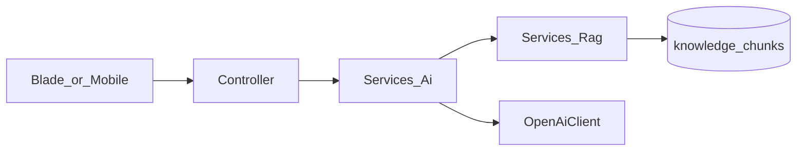

# MVC and Services conventions

## Purpose

Laravel in `aselcoph/` follows classic MVC plus a **Services** layer for business rules. Controllers stay thin: validate input, call a service, return Blade or JSON.

This convention exists because the same domain is exposed on two HTTP surfaces (Blade session UI and `/api/v1` JSON). Putting wallet, ticket, chat, announcement, and AI rules in Services prevents “fixed in web, broken on mobile” drift. Models stay focused on persistence and relationships; Jobs handle async work such as ticket AI analysis.

Mobile is intentionally **not** Laravel MVC: screens and API clients in `mobile/src/` call HTTP only. AI follows a fixed link pattern — controllers call `Services/Ai`, which may call `Services/Rag` and `OpenAiClient` — so keys, guards, and grounding stay server-side.

## Deeper explanation

- **Key concepts:** Thin controllers; fat-enough services; Eloquent models; Blade views for staff/customer web; config as feature flags; jobs for async; Access/Ai/Rag service folders as bounded contexts.
- **Invariants:** Money, ticket state machine, and AI completion calls belong in Services; ledger/audit style tables are append-oriented (see AST docs); staff writes use `config/access.php` gates/middleware; mobile never imports PHP services.
- **Common pitfalls:** Growing controllers with CIS/OpenAI/FCM calls; copying service logic into Livewire/Blade; checking only role names in views; adding mobile screens that assume undocumented response shapes; updating historical ledger rows instead of appending.

## Users / entry points

| Who | Where |
|-----|--------|
| Backend developers | `aselcoph/app/{Http/Controllers,Services,Models}` |
| Staff UI developers | `aselcoph/resources/views/` |
| Mobile developers | `mobile/src/{pages,api,auth,realtime,notifications}` |

## Layer map

| Layer | Location | Responsibility |
|-------|----------|----------------|
| Routes | `aselcoph/routes/web.php`, `api.php` | URL → controller |
| Controllers | `aselcoph/app/Http/Controllers/` | HTTP boundary |
| Services | `aselcoph/app/Services/` | Domain logic, integrations |
| Models | `aselcoph/app/Models/` | Eloquent + relationships |
| Views | `aselcoph/resources/views/` | Blade UI (staff/customer) |
| Config | `aselcoph/config/` | Feature flags and module settings |
| Jobs | `aselcoph/app/Jobs/` | Async work (e.g. ticket AI analyze) |

## Controller folders

| Folder | Used for |
|--------|----------|
| `Http/Controllers/` | Staff Blade + shared domain controllers |
| `Http/Controllers/Access/` | User / org / workspace web UI |
| `Http/Controllers/Chats/` | Support chat + legacy monitor |
| `Http/Controllers/Api/V1/` | Mobile + customer API |
| `Http/Controllers/Api/Admin/` | Staff/admin JSON API |
| `Http/Controllers/Auth/` | Google OAuth |

## Services folders

| Folder | Used for |
|--------|----------|
| `Services/` | AST, tickets, chat, announcements, notifications |
| `Services/Ai/` | OpenAI client, assistant, ticket AI, guards |
| `Services/Rag/` | Knowledge ingest, embeddings, retrieval, grounded answers |
| `Services/Access/` | Permissions, user management, activity log |

## Views layout

| Path | Content |
|------|---------|
| `resources/views/pages/staff/{ast,tickets,knowledge,access,announcements}/` | Primary staff modules |
| `resources/views/modules/chats/` | Support chat UI |
| `resources/views/components/menu/` | Role side menus (`admin`, `agent`, `cms`, …) |
| `resources/views/pages/customer/` | Customer web pages |
| `resources/views/cms/` | Legacy CMS / blog |

## Mobile counterpart (not MVC)

Mobile is **screen + API client**, not Laravel MVC:

| Layer | Location |
|-------|----------|
| Screens | `mobile/src/pages/` |
| API clients | `mobile/src/api/` |
| Auth / membership state | `mobile/src/auth/`, `membership/`, `onboarding/` |
| Realtime | `mobile/src/realtime/` |
| Push | `mobile/src/notifications/` |

Mobile never imports Laravel services. It calls `/api/v1/*` via `mobile/src/api/client.ts`.

## AI link pattern

- Customer chat → `CustomerAiController` → `AiAssistantService` → RAG + OpenAI  
- Ticket AI → `TicketAdminWebController` / `AdminTicketAiController` → `TicketAiAnalyzer` / `TicketAiResponseAssistant`  
- Knowledge admin → `KnowledgeAdminWebController` → `KnowledgeBaseService` / `DocumentProcessor`

## Naming tips for new work

- Prefer a **Service** for any money, ticket state, or AI call — do not put that in the controller.
- Keep **append-only** money and audit tables (see AST docs); never update ledger rows.
- Gate staff writes with permissions from `config/access.php`, not only role name checks in Blade.

## Scenarios

### Scenario A — Add a staff Blade write action

- **Actor:** Backend developer
- **Steps:**
  1. Add/adjust route in `web.php` with permission middleware.
  2. Keep controller thin: validate, call Service, return view/redirect.
  3. Update menu under `resources/views/components/menu/` if needed.
- **Expected result:** Same Service method is reusable from `Api/Admin` later; unauthorized users blocked before controller logic.
- **Where in code:** Routes + `Http/Controllers/` + `Services/` + `config/access.php`.

### Scenario B — Add a mobile-readable endpoint

- **Actor:** Backend + mobile developers
- **Steps:**
  1. Add route under `api.php` `/api/v1`.
  2. Implement `Http/Controllers/Api/V1/*` calling existing Service when domain overlaps.
  3. Consume from `mobile/src/api/` via `client.ts` — no PHP imports.
- **Expected result:** JSON contract documented; auth via Sanctum; no duplicated business rules in the app.
- **Where in code:** `api.php`, `Api/V1`, `mobile/src/api/client.ts`.

### Scenario C — Wire a new AI feature

- **Actor:** Backend developer
- **Steps:**
  1. Place completion/guard logic under `Services/Ai/` (and RAG under `Services/Rag/` if grounded).
  2. Call from Blade or API controller only.
  3. Respect `config/ai.php` / throttles; persist via AI/ticket models as appropriate.
- **Expected result:** Matches the AI link pattern diagram; no browser OpenAI key.
- **Where in code:** pattern above; `OpenAiClient`, `AiAssistantService`, Rag services.

## Developer discussion

- Is new domain logic in a Service (or justified Job), not a fat controller or Blade script?
- Web and API: one Service method, two controllers — or accidental divergence?
- Permissions: new `config/access.php` codes + middleware, not only menu hiding?
- Money/audit: append-only respected; no silent ledger updates?
- AI/RAG: still follows Controller → Services/Ai → (Rag) → OpenAiClient without client-side keys?

## Related modules

- [System architecture overview](overview.md)
- Web modules: [`docs/web/`](../web/)
- AST deeper contract: [aselcoph/docs/ast-wallet-architecture.md](../../aselcoph/docs/ast-wallet-architecture.md)
- Access deeper reference: [aselcoph/docs/user-management.md](../../aselcoph/docs/user-management.md)
