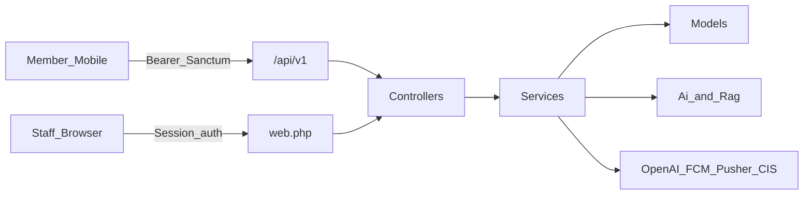
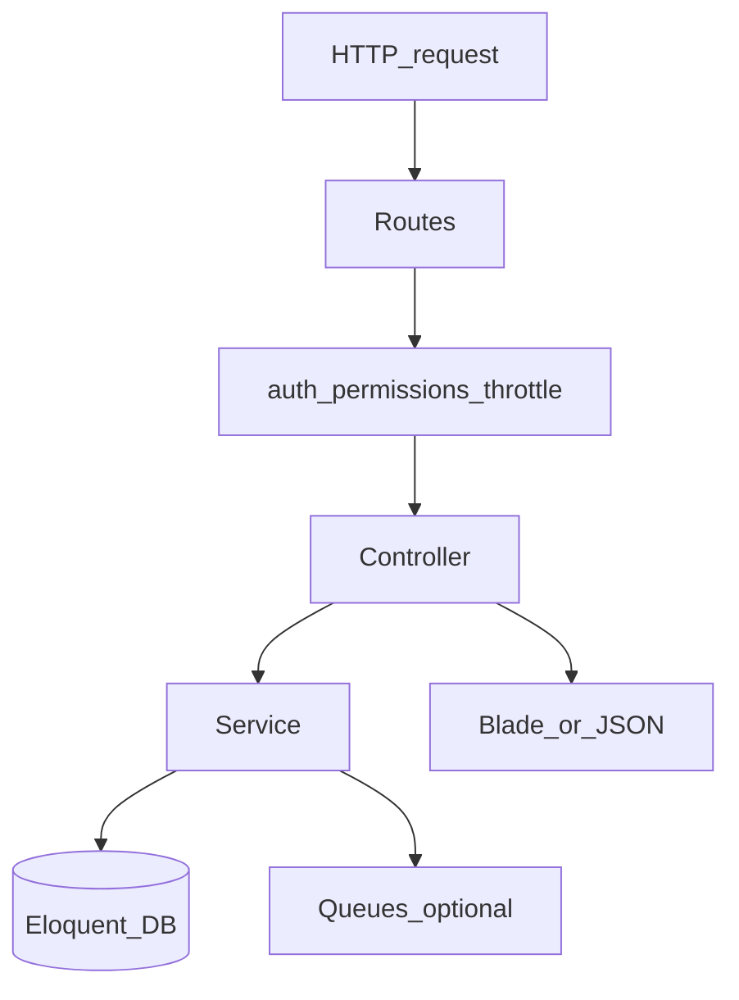

# System architecture overview

## Purpose

ASELCO Zenny is a monorepo: staff use the **Laravel Blade** portal; members use the **Ionic/Capacitor** mobile app. Both share the same domain logic through Laravel controllers and services. Mobile talks only to `/api/v1` with Sanctum bearer tokens.

The split exists so coop staff get dense operational UIs (tickets, wallet load, knowledge, access) while members get a mobile-first experience for membership, bills, AST pay, chat, and assistant. One backend avoids divergent business rules: wallet debit, ticket state, and RAG grounding are implemented once in Laravel services and reused by web session routes and JSON APIs.

Web requests enter through `web.php` with session auth and permission middleware; mobile enters through `api.php` with Sanctum PATs. External systems (OpenAI, FCM, Pusher, CIS) stay behind services so clients never hold provider secrets. Module activation is mostly routes + `config/access.php` + env flags — not a separate plugin runtime.

## Deeper explanation

- **Key concepts:** Monorepo (`aselcoph/` + `mobile/`); shared Controllers → Services → Models path; Sanctum for mobile; Jetstream/Fortify for staff/customer web; permission catalog and middleware as the staff authorization spine; optional queues/jobs for async AI work.
- **Invariants:** Mobile never imports Laravel PHP; money/ticket/AI mutations belong in Services; staff writes gated by access codes/middleware; feature env flags (`AI_ENABLED`, `AST_*`, `ACCESS_*`) must be considered part of deploy config.
- **Common pitfalls:** Duplicating domain rules in Ionic; calling OpenAI/FCM from the client; Blade-only `@if(role)` checks without matching route middleware; adding “temporary” APIs outside `/api/v1` that mobile then hard-depends on.

## Users / entry points

| Who | Where |
|-----|--------|
| Members | Ionic app → `/api/v1` |
| Staff | Browser → `web.php` Blade portal |
| Integrations | Services → OpenAI, FCM, Pusher, CIS |

## Context

## Apps

| App | Stack | Entry |
|-----|--------|-------|
| Staff web | Laravel 12, Jetstream/Fortify, Blade, Livewire, Vite/Tailwind | `aselcoph/` |
| Mobile | Ionic React 8, Capacitor 8, Vite | `mobile/` (`appId`: `com.aselco.ph`) |
| API | Sanctum PATs under `/api/v1` | `aselcoph/routes/api.php` |

## Request path (direct)

## How modules are activated

| Mechanism | Where | Effect |
|-----------|--------|--------|
| Routes | `aselcoph/routes/web.php`, `api.php` | Exposes URLs |
| Permissions | `aselcoph/config/access.php` | Gates menus and APIs |
| Middleware | `can.load-wallet`, `can.manage-tickets`, `can.permission:*` | Protects write paths |
| Side menus | `resources/views/components/menu/*` | Role-based nav |
| Env flags | `AI_ENABLED`, `AST_*`, `ACCESS_*` | Feature toggles |

## Shared feature map (web ↔ mobile)

| Domain | Web | Mobile | API prefix |
|--------|-----|--------|------------|
| Auth | Jetstream / Google OAuth | Login / Register | `/auth` |
| Membership | Account link / validation | Membership setup | `/membership` |
| AST Wallet | `/ast/*` admin | Wallet + Pay tabs | `/customer/wallet`, `/wallet` |
| Tickets | `/tickets/*` | Tickets + Complaints | `/customer/tickets` |
| AI | Ticket AI + knowledge chat | Assistant | `/customer/ai`, `/admin/ai` |
| Knowledge/RAG | `/knowledge/*` | (via AI answers) | `/admin/knowledge` |
| Support chat | `/chats/support/*` | Support chat | `/customer/support-chat` |
| Notifications | Announcements UI | Push register | `/notifications`, `/devices` |

## Scenarios

### Scenario A — Member pays a bill from mobile

- **Actor:** Mobile member
- **Steps:**
  1. Authenticate via `/api/v1/auth/*` (Sanctum).
  2. Membership/dashboard APIs confirm linked accounts.
  3. Pay via customer wallet API; staff may post CIS from web later.
- **Expected result:** Debit and audit occur in Laravel wallet services; mobile only sees JSON success/error.
- **Where in code:** `api.php` → customer wallet controllers → `AstWalletService`; web CIS queue under `/ast/*`.

### Scenario B — Staff works a ticket with AI assist

- **Actor:** Ticket staff
- **Steps:**
  1. Session login; open `/tickets/*` (permission middleware).
  2. Progress ticket via `TicketService`.
  3. Optionally analyze/suggest via Services/Ai; knowledge may ground customer AI separately.
- **Expected result:** Ticket state and AI drafts persist server-side; OpenAI key never reaches the browser as a callable client secret.
- **Where in code:** `web.php` ticket routes → `TicketAdminWebController` → `TicketService` / `Services/Ai/*`.

### Scenario C — Enabling a feature in an environment

- **Actor:** Deploy / admin engineer
- **Steps:**
  1. Confirm routes exist in `web.php` / `api.php`.
  2. Set permission codes in `config/access.php` and menus under `components/menu/*`.
  3. Toggle env flags (`AI_ENABLED`, `AST_*`, `ACCESS_*`) and middleware on write paths.
- **Expected result:** Feature visible/callable only when route + permission + env align.
- **Where in code:** activation table above; module docs under `docs/web/`.

## Developer discussion

- Does this change keep domain logic in Services shared by web and API, or only in one surface?
- Are new staff writes protected by `config/access.php` codes and middleware, not only Blade menus?
- Mobile: still Sanctum `/api/v1` only — no new ad-hoc endpoints without docs?
- Secrets: OpenAI/FCM/Pusher/CIS credentials remain server-side?
- What must not break: auth split (session vs PAT), wallet/ticket invariants, and the shared feature map contracts.

## Related modules

- [MVC conventions](mvc-conventions.md)
- [aselcoph/docs/ast-wallet-architecture.md](../../aselcoph/docs/ast-wallet-architecture.md)
- [aselcoph/docs/user-management.md](../../aselcoph/docs/user-management.md)
- [aselcoph/docs/api/](../../aselcoph/docs/api/) (OpenAPI + Postman)
- Web module docs under [`docs/web/`](../web/)
