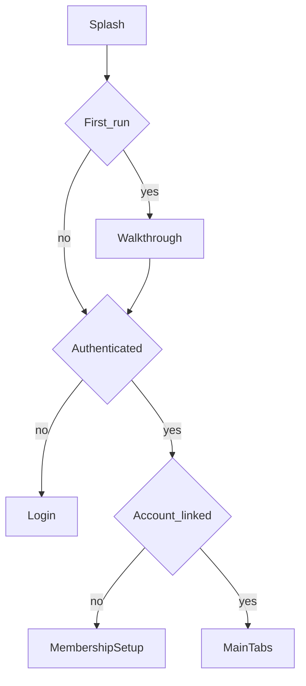

# Mobile modules (Ionic / Capacitor)

Customer app **myASELCO** lives in `mobile/`. All live data goes through `VITE_API_BASE_URL` → Laravel `/api/v1` with Sanctum bearer tokens (`mobile/src/api/client.ts`).

## Active modules

| Module | Doc | Routes / screens |
|--------|-----|------------------|
| Auth | [auth.md](auth.md) | `/login`, `/register` |
| Onboarding | [onboarding.md](onboarding.md) | `/welcome`, `/walkthrough` |
| Membership | [membership.md](membership.md) | `/membership/setup` |
| Home / Dashboard | [home-dashboard.md](home-dashboard.md) | `/tabs/home` |
| Ledger | [ledger.md](ledger.md) | `/tabs/ledger` |
| AST Wallet | [ast-wallet.md](ast-wallet.md) | `/wallet` |
| Pay with AST | [pay-with-ast.md](pay-with-ast.md) | `/tabs/pay` |
| Tickets | [tickets.md](tickets.md) | `/tabs/tickets`, `/tickets/:id` |
| Complaints (create ticket) | [complaints.md](complaints.md) | `/complaints` |
| AI Assistant | [ai-assistant.md](ai-assistant.md) | `/assistant` |
| Support Chat | [support-chat.md](support-chat.md) | `/support`, `/support/chat` |
| Profile | [profile.md](profile.md) | `/tabs/profile` |
| Notifications / Push | [notifications.md](notifications.md) | `/notifications` + device register |

## Inactive (not documented in depth)

- `Tab1.tsx`, `Tab2.tsx`, `Tab3.tsx` — Ionic starter stubs, not routed.

## Partial mock UI (note in module docs)

- Home “Recent Activity”, Notifications inbox list, Support FAQ/contact — still use `mobile/src/data/mockData.ts` in places while other APIs are live.

## Gate flow

