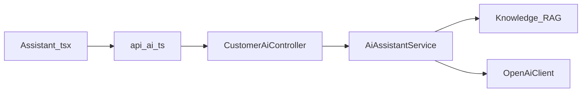
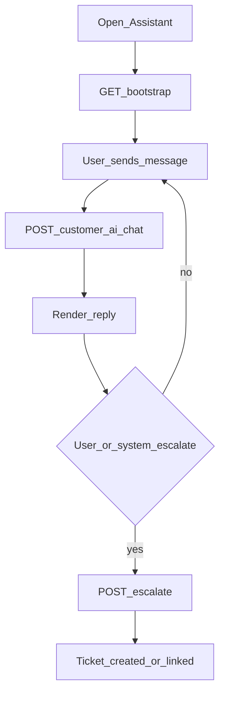

# Mobile — AI Assistant

## Purpose

Customer AI chat with conversation history and escalate-to-ticket. All model calls happen on the Laravel server; mobile only sends messages over Sanctum — the device never holds OpenAI keys or RAG indexes.

**Mobile UX:** `/assistant` chat UI: bootstrap → send/receive → optional escalate. History/conversation management via customer AI conversation endpoints.

**Owning Laravel API:** `CustomerAiController` — bootstrap, chat, inquiry, escalate, conversations CRUD. Server uses `AiAssistantService`, RAG, and `OpenAiClient`. Knowledge corpus is managed on web ([Knowledge / RAG](../web/knowledge-rag.md)).

## Users / entry points

| Who | Where |
|-----|--------|
| Linked members | `/assistant` |

## Context diagram

## Process flowchart

## File map

| Layer | Path |
|-------|------|
| UI | `pages/Assistant.tsx` |
| API | `api/ai.ts` |
| Types | `AiBootstrap`, `AiCustomerReply`, conversation types |

## Routes / API

Mobile: `/assistant`.

Backend: `GET /customer/ai/bootstrap`; `POST /chat`, `/inquiry`, `/escalate`; `GET|DELETE /conversations[/{id}]`.  
(`POST /customer/ai/search` exists on backend but is not wrapped in `api/ai.ts` yet.)

## Backend link

- Laravel: `Api/V1/CustomerAiController.php`, `Services/Ai/*`, `Services/Rag/*`
- Web: [AI Assistant](../web/ai-assistant.md), [Knowledge / RAG](../web/knowledge-rag.md)

## Deeper explanation

**Screen / state pattern:** On open, `GET bootstrap` seeds capabilities/disclaimers/conversation id. Chat posts user text; UI appends assistant replies. Escalate POSTs when the member (or policy) wants a human ticket. Conversation list/delete keeps local UI in sync with server history.

**API client:** `api/ai.ts` is Sanctum-only; no streaming client assumed unless added later — treat replies as full response payloads. Search endpoint exists server-side but is unwired on mobile.

**Offline / mock:** AI requires network and server AI config. No on-device LLM fallback. Show clear errors when AI is disabled or rate-limited rather than mock answers.

**Membership gate impact:** Assistant is behind linked membership. Escalated tickets flow into [Tickets](tickets.md) / staff queues. Prefer Support Chat when the member wants a live human without AI.

## Scenarios

### Ask a billing FAQ

- **Actor:** Linked member.
- **Steps:** Open Assistant → bootstrap → send question → `POST /chat` → render reply (RAG-backed on server).
- **Expected result:** Helpful answer + any citations/disclaimer from bootstrap policy; no ticket created.
- **Files involved:** `Assistant.tsx`, `api/ai.ts`, `CustomerAiController`, RAG services.

### Escalate to ticket

- **Actor:** Member unsatisfied with AI answers.
- **Steps:** Trigger escalate → `POST /escalate` → ticket created/linked → optionally navigate to ticket detail.
- **Expected result:** Ticket appears in Tickets tab and staff web; conversation tied for context.
- **Files involved:** `Assistant.tsx`, `api/ai.ts`, Tickets module, `TicketService`.

### Resume prior conversation

- **Actor:** Returning member.
- **Steps:** Open Assistant → load conversations → select id → continue chat.
- **Expected result:** History restored from server; new messages append to same conversation.
- **Files involved:** `Assistant.tsx`, `api/ai.ts` (conversations GET).

## Developer discussion

1. Should mobile implement streaming tokens for perceived latency, or keep request/response?
2. When is escalate offered automatically vs only on explicit user action?
3. How do we surface “AI disabled / quota exceeded” distinctly from generic network errors?
4. Wire `POST /customer/ai/search` or remove it from public API docs until used?
5. What PII must never be echoed in AI replies, and how is that enforced server-side?

## Related modules

- [Tickets](tickets.md)
- [Complaints](complaints.md)
- [Support Chat](support-chat.md) — human alternative
