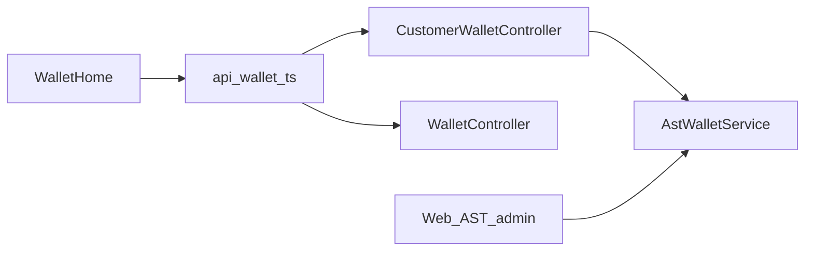
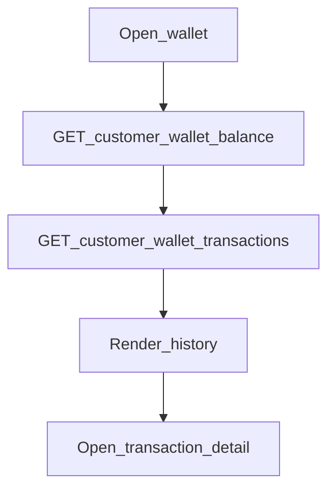

# Mobile — AST Wallet

## Purpose

Shows the member’s ASELCO Token (AST) balance and transaction history. Loading AST onto a wallet is staff-only on the web portal; mobile is **read balance/history** plus navigation into Pay (separate screen) to spend AST on bills.

**Mobile UX:** `/wallet` summary + list; drill-down `/wallet/transactions/:id`. Home balance card teasers the same wallet summary.

**Owning Laravel API:** Primary customer routes on `CustomerWalletController` (`GET /customer/wallet/balance`, `GET /customer/wallet/transactions`). Alternate `WalletController` routes (`GET /wallet`, `/wallet/transactions`) also exist — prefer the customer-prefixed client methods used by the app.

## Users / entry points

| Who | Where |
|-----|--------|
| Linked members | `/wallet`, transaction detail `/wallet/transactions/:id` |
| Home | Balance card teaser |

## Context diagram

## Process flowchart

## File map

| Layer | Path |
|-------|------|
| UI | `pages/WalletHome.tsx`, `WalletTransactionDetail.tsx` |
| API | `api/wallet.ts` |
| Local | `api/walletAttemptStorage.ts` (used heavily by Pay) |
| Types | `WalletSummary`, `WalletTransaction`, … |

## Routes / API

Mobile: `/wallet`, `/wallet/transactions/:id`.

Backend (primary): `GET /customer/wallet/balance`, `GET /customer/wallet/transactions`.  
Also available: `GET /wallet`, `/wallet/transactions`.

## Backend link

- Laravel: `CustomerWalletController`, `WalletController`, `AstWalletService`
- Web: [AST Wallet](../web/ast-wallet.md)

## Deeper explanation

**Screen / state pattern:** Wallet screens are mostly presentational: fetch balance + paginated/list transactions via `api/wallet.ts`, then navigate to detail by id. No local “top-up” UI — members cannot mint AST on device.

**API client:** Customer wallet endpoints under Sanctum. Shared `api/wallet.ts` also hosts Pay helpers (`payBillWithAst`) and idempotency headers; keep read paths free of write side effects. `walletAttemptStorage` is for Pay retries, not for faking balance offline.

**Offline / mock:** Balance/history are online reads. Do not use `mockData` TokenWallet shapes as live truth on production builds. After Pay succeeds, Wallet and Home should refresh so history includes the new debit.

**Membership gate impact:** Wallet routes sit behind the linked-account gate like other member features. Without membership, users never reach `/wallet`. Pay still needs a matching linked billing account even when AST balance is positive.

## Scenarios

### Check AST balance

- **Actor:** Linked member.
- **Steps:** Open `/wallet` → `GET .../balance` (+ transactions) → render summary and list.
- **Expected result:** Balance matches staff/web AST ledger for that customer wallet.
- **Files involved:** `WalletHome.tsx`, `api/wallet.ts`.

### Inspect a transaction

- **Actor:** Member reviewing a past pay or credit.
- **Steps:** Tap row → `/wallet/transactions/:id` → show detail fields from list payload or follow-up fetch.
- **Expected result:** Clear type/amount/timestamps; correlates with ledger/CIS where applicable.
- **Files involved:** `WalletTransactionDetail.tsx`, `api/wallet.ts`.

### After paying a bill

- **Actor:** Member returning from Pay success.
- **Steps:** Navigate to Wallet or Home → refetch balance/transactions.
- **Expected result:** Debit visible; no reliance on `walletAttemptStorage` for display (that storage is attempt/idempotency only).
- **Files involved:** `Pay.tsx`, `WalletHome.tsx`, `walletAttemptStorage.ts`, `api/wallet.ts`.

## Developer discussion

1. Which client path is canonical — `/customer/wallet/*` vs `/wallet/*` — and can we delete the unused one from `api/wallet.ts`?
2. How should empty history and zero balance be explained so members know top-up is office/staff-driven?
3. Do transaction detail routes need a dedicated GET-by-id if list pagination drops the item?
4. Should Wallet subscribe to push events when staff loads AST?
5. How do we keep Home’s AST teaser and WalletHome from racing with different cached values?

## Related modules

- [Pay with AST](pay-with-ast.md)
- [Home](home-dashboard.md)
- [Ledger](ledger.md)
