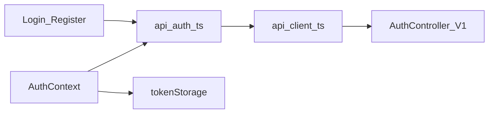
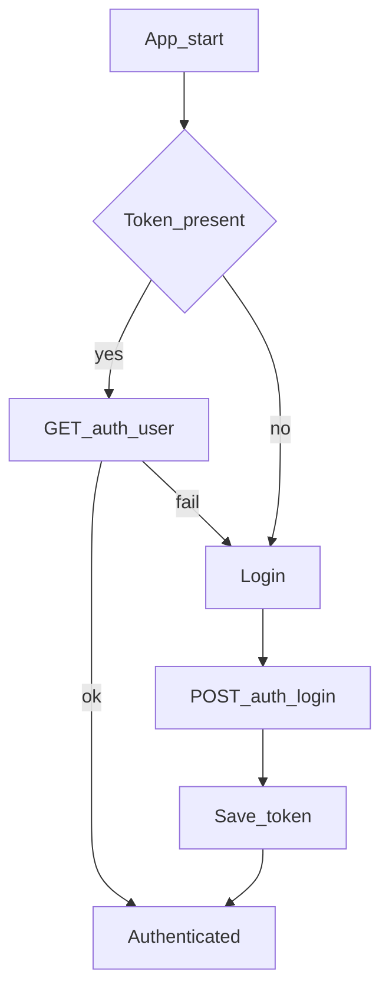

# Mobile — Auth

## Purpose

Register, login, logout, session restore, and email verification resend for the myASELCO app. This is the first Laravel-backed gate after local onboarding: without a valid Sanctum personal access token (PAT), no membership, dashboard, wallet, or ticket APIs can run.

**Mobile UX:** Ionic pages for `/login` and `/register`; `AuthContext` owns boot-time restore so the user lands on tabs or membership setup without re-entering credentials when the token is still valid.

**Owning Laravel API:** `AuthController` under `/api/v1/auth/*` (Sanctum). Tokens are stored in Capacitor Preferences via `tokenStorage` and attached by `api/client.ts` on every request.

## Users / entry points

| Who | Where |
|-----|--------|
| New users | `/register` |
| Returning users | `/login` |
| App boot | `AuthContext` restores token → `GET /auth/user` |

## Context diagram

## Process flowchart

## File map

| Layer | Path |
|-------|------|
| UI | `mobile/src/pages/Login.tsx`, `Register.tsx` |
| State | `mobile/src/auth/AuthContext.tsx` |
| API | `mobile/src/api/auth.ts`, `tokenStorage.ts`, `client.ts` |
| Types | `mobile/src/api/types.ts` (`AuthUser`, payloads) |

## Routes / API

Mobile routes: `/login`, `/register`.

Backend (`/api/v1`): `POST /auth/register`, `/auth/login`, `/auth/logout`, `/auth/logout-all`, `GET /auth/user`, `POST /auth/email/resend`.

## Permissions / feature flags

Requires verified email for most membership/dashboard routes (`verified` middleware on API).

## Backend link

- Laravel: `aselcoph/app/Http/Controllers/Api/V1/AuthController.php`
- Web counterpart: [Auth & Profile](../web/auth-profile.md)

## Deeper explanation

**Screen / state pattern:** `AuthContext` hydrates from Preferences on boot, then calls `GET /auth/user`. Login/register pages call thin wrappers in `api/auth.ts`; success writes the token and updates context so `App.tsx` routing can leave the auth gate.

**API client:** `client.ts` prefixes `VITE_API_BASE_URL`, sends `Authorization: Bearer …`, and surfaces Laravel validation / 401 errors to the UI. Logout clears the token and typically clears related local caches (e.g. ledger snapshot) so the next session cannot leak prior-account data.

**Offline / mock:** Auth itself is online-only; there is no mock login path. A stale or revoked token fails `/auth/user` and forces the login screen.

**Membership gate impact:** Authentication alone does not unlock main tabs. After a successful session, `MembershipContext` still requires at least one linked service account; otherwise the user is redirected to `/membership/setup`. Email verification on the API can block membership and dashboard calls even when the mobile session looks “logged in.”

## Scenarios

### New member registers

- **Actor:** First-time customer installing myASELCO.
- **Steps:** Complete onboarding → open Register → submit name/email/password → app stores PAT → routing continues to membership (or email-verify messaging if required).
- **Expected result:** Sanctum token persisted; `AuthContext` reports authenticated; next gate is membership setup, not Home.
- **Files involved:** `Register.tsx`, `api/auth.ts`, `tokenStorage.ts`, `AuthContext.tsx`, `App.tsx`.

### Returning member cold start

- **Actor:** Previously logged-in member reopening the app.
- **Steps:** App boots → Preferences token found → `GET /auth/user` succeeds → membership status loads.
- **Expected result:** No login form if token valid; user reaches tabs (if linked) or membership setup (if not).
- **Files involved:** `AuthContext.tsx`, `tokenStorage.ts`, `api/auth.ts`, `MembershipContext.tsx`, `App.tsx`.

### Sign out from Profile

- **Actor:** Linked member choosing Sign out.
- **Steps:** Profile triggers logout → `POST /auth/logout` → clear token (and local caches) → redirect to login.
- **Expected result:** Subsequent API calls are unauthenticated; Home/Pay/Ledger are unreachable until login again.
- **Files involved:** `Profile.tsx`, `AuthContext.tsx`, `api/auth.ts`, `ledgerStorage.ts` (cache clear).

## Developer discussion

1. What should happen when `/auth/user` returns 401 versus a network timeout — same UX, or a “retry / offline” path?
2. Is email verification messaging complete enough on mobile, or do users get stuck after register with a silent `verified` middleware failure?
3. Should `logout-all` be exposed in the Profile UI for shared-device security?
4. How do we keep `AuthUser` types in `types.ts` aligned with Laravel’s `/auth/user` resource shape when staff fields change?
5. On logout, which Preferences keys must always be cleared to avoid cross-account leakage (ledger, wallet attempts, onboarding)?

## Related modules

- [Onboarding](onboarding.md)
- [Membership](membership.md)
- [Profile](profile.md)
