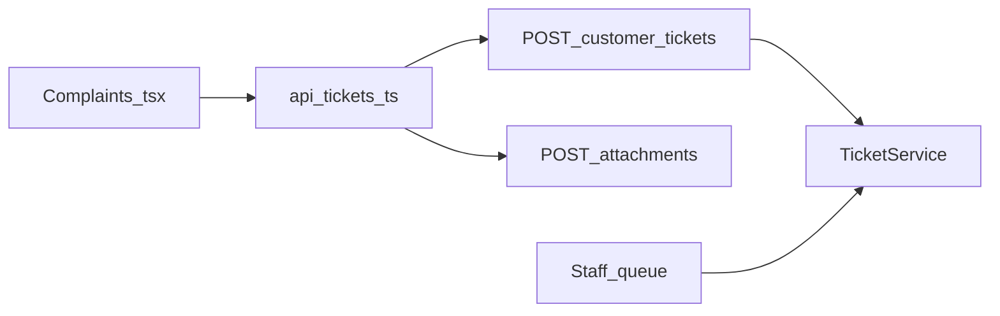
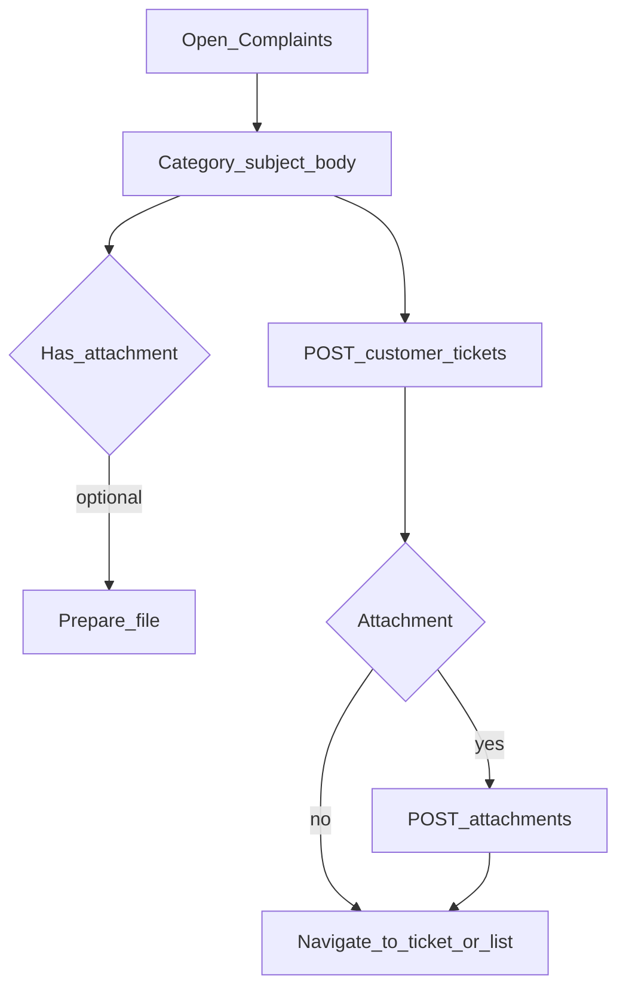

# Mobile — Complaints (Create Ticket)

## Purpose

File a new complaint/request with category and optional attachment. Creates a ticket on the shared tickets backend (categories currently use seed IDs 1–6 in the screen) so staff can triage in the web Tickets module.

**Mobile UX:** Full-page `/complaints` form (category, subject, body, optional file) reachable from Home quick action; on success navigates toward ticket detail or the tickets list.

**Owning Laravel API:** `CustomerTicketController` — `POST /customer/tickets`, `POST /customer/tickets/{id}/attachments`. Same `TicketService` as staff web.

## Users / entry points

| Who | Where |
|-----|--------|
| Linked members | `/complaints` |
| Home quick action | Complaints |

## Context diagram

## Process flowchart

## File map

| Layer | Path |
|-------|------|
| UI | `pages/Complaints.tsx` |
| API | `api/tickets.ts` (`createCustomerTicket`, `uploadTicketAttachment`) |

## Routes / API

Mobile: `/complaints`.

Backend: `POST /customer/tickets`, `POST /customer/tickets/{id}/attachments`.

## Backend link

- Laravel: `CustomerTicketController`
- Web: [Tickets](../web/tickets.md), legacy [Consumers](../web/consumers-billing.md) complaints UI

## Deeper explanation

**Screen / state pattern:** Controlled form in `Complaints.tsx`. Create ticket first, then upload attachment against the new id if a file was chosen — two-step so multipart failure does not block ticket creation (or define transactional UX if product requires attach-or-fail).

**API client:** Shared `api/tickets.ts` with the Tickets inbox. Category IDs 1–6 are currently hard-coded seeds — they must stay aligned with Laravel ticket category seeds or move to a categories GET when available.

**Offline / mock:** Submit is online-only. Do not queue fake tickets in Preferences without a sync story. Photo/file size limits should match backend validation.

**Membership gate impact:** Route is behind linked membership. Created tickets immediately belong to the Sanctum user and show under Tickets after refresh.

## Scenarios

### File complaint without attachment

- **Actor:** Linked member reporting an outage/issue.
- **Steps:** Open Complaints → pick category → subject/body → POST create → navigate to list/detail.
- **Expected result:** Ticket visible to member and in staff queue; category id accepted by API.
- **Files involved:** `Complaints.tsx`, `api/tickets.ts`, `CustomerTicketController`.

### File complaint with photo

- **Actor:** Member attaching evidence.
- **Steps:** Fill form + pick file → POST ticket → POST attachment multipart → done.
- **Expected result:** Ticket has attachment metadata; staff can download on web; member sees success even if they remain on list.
- **Files involved:** `Complaints.tsx`, `api/tickets.ts` (`uploadTicketAttachment`).

### Validation failure

- **Actor:** Member submitting empty subject or invalid category.
- **Steps:** POST → 422 from Laravel → show field errors.
- **Expected result:** No orphan navigation to detail; user can correct and resubmit.
- **Files involved:** `Complaints.tsx`, `api/client.ts`, `api/tickets.ts`.

## Developer discussion

1. Should categories be fetched from an API instead of hard-coded IDs 1–6?
2. If attachment upload fails after create, do we keep the ticket and prompt retry, or offer delete?
3. Cap file types/sizes on client to match Laravel validation messages?
4. Should create require selecting a linked service account number in the payload?
5. How do we distinguish Complaints-origin vs AI-escalate tickets in the member list?

## Related modules

- [Tickets](tickets.md)
- [Home](home-dashboard.md)
- [Support Chat](support-chat.md)
