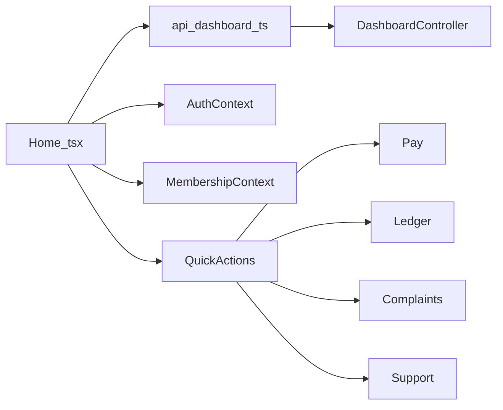
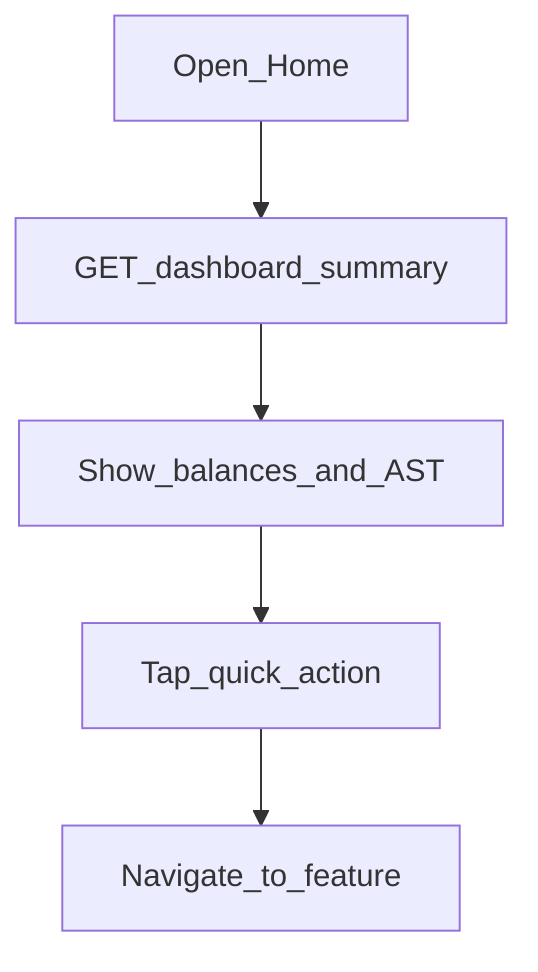

# Mobile — Home / Dashboard

## Purpose

Main tab greeting with AST wallet summary, per-account balances (from dashboard/ledger cache), and quick actions to Pay, Ledger, Complaints, and Support. Home is the post-membership landing surface for day-to-day coop account awareness.

**Mobile UX:** `/tabs/home` with header, balance/AST teasers, quick-action grid, and a “Recent Activity” area. Primary numbers should come from live dashboard APIs; some secondary lists may still be mock.

**Owning Laravel API:** `DashboardController` — `GET /api/v1/dashboard/summary` (aggregates wallet + billing context for linked accounts). AST detail/pay still owned by customer wallet controllers.

## Users / entry points

| Who | Where |
|-----|--------|
| Linked members | `/tabs/home` |

## Context diagram

## Process flowchart

Note: “Recent Activity” may still read from `data/mockData.ts`.

## File map

| Layer | Path |
|-------|------|
| UI | `pages/Home.tsx` |
| Components | `components/BalanceCard.tsx`, `QuickActions.tsx`, `AppHeader.tsx` |
| API | `api/dashboard.ts`, `ledgerStorage.ts` |
| Types | `DashboardSummary`, `WalletSummary` |

## Routes / API

Mobile: `/tabs/home`.

Backend: `GET /api/v1/dashboard/summary`.

## Backend link

- Laravel: `Api/V1/DashboardController.php`
- Web: [Dashboard](../web/dashboard.md), [AST Wallet](../web/ast-wallet.md), [Consumers / Billing](../web/consumers-billing.md)

## Deeper explanation

**Screen / state pattern:** `Home.tsx` reads `AuthContext` (greeting) and `MembershipContext` (linked accounts), then loads `getDashboardSummary`. It may also peek at `ledgerStorage` cached snapshots for snappier per-account balance display before/alongside the network response. Quick actions are navigation-only; they do not mutate server state.

**API client:** `api/dashboard.ts` → Sanctum `GET /dashboard/summary`. Wallet balance on the card should stay consistent with `/customer/wallet/*` used on Wallet/Pay; treat summary as a composite read model, not a second source of truth for payments.

**Offline / mock:** “Recent Activity” (and some type imports from `mockData.ts`) may still be seed data — do not treat that list as live ledger. Cached ledger snapshots can show stale balances when offline; prefer empty/error states over inventing numbers when both network and cache miss.

**Membership gate impact:** Unlinked users never see Home; `App.tsx` redirects to `/membership/setup`. Multi-account members rely on membership state to know which accounts the summary covers.

## Scenarios

### Linked member opens Home

- **Actor:** Member with at least one linked account.
- **Steps:** Land on `/tabs/home` after auth+membership → fetch dashboard summary → render balances/AST → optional cache merge.
- **Expected result:** Greeting + live summary fields; quick actions navigate to Pay/Ledger/Complaints/Support.
- **Files involved:** `Home.tsx`, `api/dashboard.ts`, `BalanceCard.tsx`, `QuickActions.tsx`, `MembershipContext.tsx`.

### Quick action to Pay

- **Actor:** Member paying the current bill.
- **Steps:** Tap Pay on Home → navigate to `/tabs/pay` → Pay screen loads bill context from dashboard/wallet APIs.
- **Expected result:** Pay receives enough context to show amount/account; no duplicate payment from Home itself.
- **Files involved:** `QuickActions.tsx`, `Pay.tsx`, `api/dashboard.ts`, `api/wallet.ts`.

### Offline with ledger cache

- **Actor:** Member with poor connectivity who previously loaded ledger.
- **Steps:** Open Home → dashboard request fails or is slow → UI may fall back to cached ledger-derived figures where implemented.
- **Expected result:** Stale-but-labeled or partial UI; Recent Activity must not be mistaken for live API if still mocked.
- **Files involved:** `Home.tsx`, `ledgerStorage.ts`, `data/mockData.ts`.

## Developer discussion

1. Which Home fields are guaranteed live vs still mock — can we label or remove mock sections before release?
2. Should dashboard summary and wallet balance share one refresh hook to avoid mismatched AST amounts?
3. How do we present multi-account summaries without overcrowding the first viewport?
4. What empty state do we show when summary succeeds but all balances are zero?
5. Is pull-to-refresh required on Home for field ops with flaky networks?

## Related modules

- [AST Wallet](ast-wallet.md)
- [Pay with AST](pay-with-ast.md)
- [Ledger](ledger.md)
- [Membership](membership.md)
