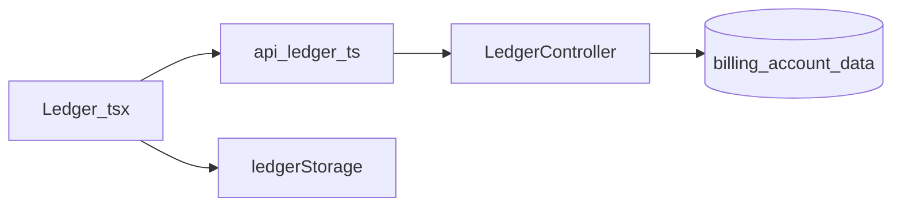
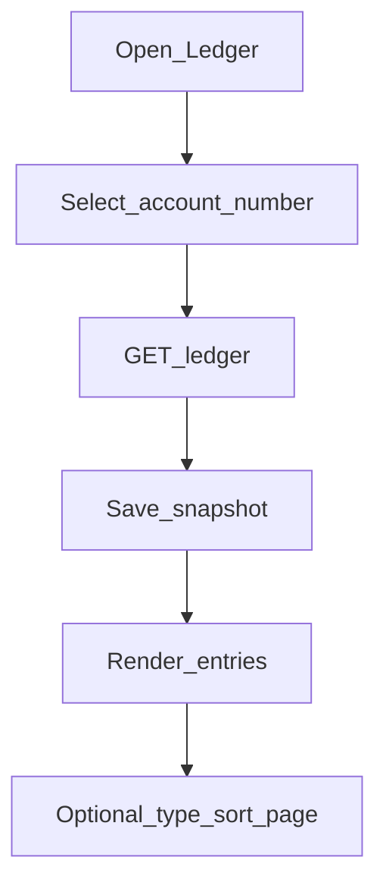

# Mobile — Ledger

## Purpose

Shows bills and payments for a linked account number, with an offline snapshot cache for faster reloads. Ledger is the member-facing history of billing activity that staff upload/manage on the web consumers/billing pipeline.

**Mobile UX:** `/tabs/ledger` with account picker (from membership), filters/sort/pagination, and entry list. Snapshots in Preferences/local storage speed repeat visits.

**Owning Laravel API:** `LedgerController` — `GET /api/v1/ledger` with `account_number`, paging, type, sort, and snapshot query params.

## Users / entry points

| Who | Where |
|-----|--------|
| Linked members | `/tabs/ledger` |

## Context diagram

## Process flowchart

## File map

| Layer | Path |
|-------|------|
| UI | `pages/Ledger.tsx` |
| API | `api/ledger.ts`, `ledgerStorage.ts` |
| Types | `LedgerResponse`, `LedgerEntry`, … |

## Routes / API

Mobile: `/tabs/ledger`.

Backend: `GET /api/v1/ledger?account_number=&page=&type=&sort=&snapshot=`.

## Backend link

- Laravel: `Api/V1/LedgerController.php`
- Web: [Consumers / Billing](../web/consumers-billing.md) (upload pipeline feeds ledger)

## Deeper explanation

**Screen / state pattern:** `Ledger.tsx` takes the active/selected account from `MembershipContext`, calls `api/ledger.ts`, then writes a snapshot via `ledgerStorage` for Home and offline use. Filters (type/sort/page) re-query the API rather than inventing client-side truth for large histories.

**API client:** Query-string driven GET; Sanctum auth required. Snapshot parameter supports server-assisted cache semantics where implemented — keep client snapshot keys namespaced per account (and cleared on logout).

**Offline / mock:** `ledgerStorage` enables stale reads when the network fails. Fallback imports from `mockData.ts` may still exist for empty/dev states — production UX should prefer cache or explicit error over silent mock bills. Auth logout clears ledger cache to prevent account bleed.

**Membership gate impact:** No linked account ⇒ no Ledger tab access (redirect to setup). Account picker only lists membership-linked numbers; pay/bill amounts shown here should match what Pay uses from dashboard/billing ids.

## Scenarios

### View current account history

- **Actor:** Linked member.
- **Steps:** Open Ledger → select account → `GET /ledger` → render entries → save snapshot.
- **Expected result:** Bills/payments list matches backend for that account; subsequent open can show snapshot quickly.
- **Files involved:** `Ledger.tsx`, `api/ledger.ts`, `ledgerStorage.ts`, `MembershipContext.tsx`.

### Filter by type / paginate

- **Actor:** Member looking for payments only.
- **Steps:** Change type/sort or page → new GET with query params → list updates.
- **Expected result:** Server-filtered page; local snapshot policy decided (overwrite full vs keep last unfiltered).
- **Files involved:** `Ledger.tsx`, `api/ledger.ts`.

### Offline reopen after prior fetch

- **Actor:** Member without connectivity.
- **Steps:** Open Ledger → network fails → load last snapshot for account if present.
- **Expected result:** Stale indicator or equivalent; no fabricated mock ledger presented as live if avoidable.
- **Files involved:** `Ledger.tsx`, `ledgerStorage.ts`, optionally `mockData.ts`.

## Developer discussion

1. When should snapshot overwrite happen — every successful fetch, or only when unfiltered?
2. How do we signal “stale cache” vs “live” in the UI without clutter?
3. Are billing ids on ledger entries sufficient for Pay deep-links, or must Pay always re-fetch dashboard summary?
4. Multi-account: should we prefetch snapshots for all linked accounts on membership ready?
5. Confirm logout always clears `ledgerStorage` for every account key.

## Related modules

- [Home](home-dashboard.md)
- [Pay with AST](pay-with-ast.md)
- [Membership](membership.md)
