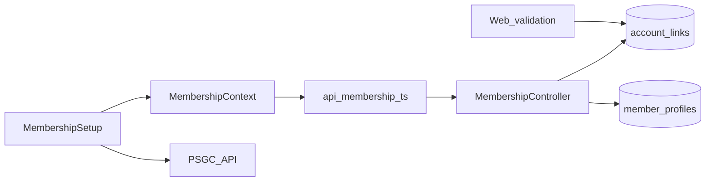
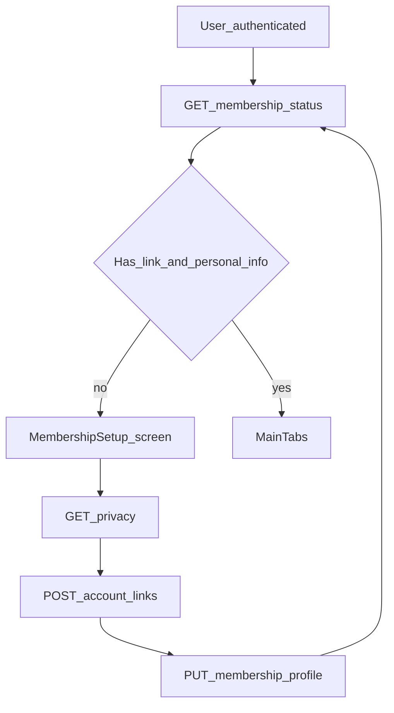

# Mobile — Membership / Account Linking

## Purpose

Blocks main tabs until the member links at least one electric service account **and** submits membership personal information. Shows privacy copy, account-link requests, and the personal-information step from the ASELCO membership application (address via PSGC, remaining fields as free text).

**Mobile UX:** Forced full-screen `/membership/setup` (not a tab): privacy → account number → preview/submit → personal information → done. Profile can add more links later (`?add=1`) and skips personal info. Until `MembershipContext` reports a linked account **and** saved personal info, `App.tsx` redirects tab and feature routes back to setup.

**Owning Laravel API:** `MembershipController` — `GET /membership/status`, privacy, account-links, `GET|PUT /membership/profile`, linked-accounts. Staff validation / approval of links happens on the web consumers/billing side.

## Users / entry points

| Who | Where |
|-----|--------|
| Authenticated members without links or personal info | `/membership/setup` (forced gate) |
| Profile | Linked accounts list / add link |

## Context diagram

## Process flowchart

Address (region → province → municipality/city → barangay) is loaded from the [PSGC API](https://psgc.gitlab.io/api/). Street and sitio are typed in because they are not in PSGC. Membership O.R.#, area manager, and date issued are staff-only and are not collected on mobile. Date of seminar is optional.

## File map

| Layer | Path |
|-------|------|
| UI | `pages/membership/MembershipSetup.tsx`, `PersonalInformationForm.tsx`; Profile linked-accounts UI |
| State | `membership/MembershipContext.tsx` |
| API | `api/membership.ts`, `api/psgc.ts` |
| Utils | `utils/serviceAccount.ts` |
| Types | `types.ts` (`MembershipStatus`, `AccountLink`, `MemberProfile`, …) |

## Routes / API

Mobile: `/membership/setup`.

Backend: `GET /membership/status`, `/privacy`, `GET|POST /membership/account-links`, `GET|PUT /membership/profile`, `GET /membership/linked-accounts`.

## Backend link

- Laravel: `Api/V1/MembershipController.php`, `Services/MemberProfileService.php`, `Models/MemberProfile.php`
- Web: [Consumers / Billing](../web/consumers-billing.md) (validation, staff linking)

## Deeper explanation

**Screen / state pattern:** After auth, `MembershipContext` fetches status, linked accounts, and member profile, then exposes helpers used by `App.tsx` redirects and by Home/Ledger/Pay for the active account number. `MembershipSetup` loads privacy text, validates the service account format, POSTs a link request, then collects personal information. Geographic selects call PSGC directly; if that API is down, the same fields become free text.

**API client:** Thin `api/membership.ts` wrappers over Sanctum-authenticated `/api/v1` membership routes. Status includes `has_personal_info`; the stepper stays required until both an account link and a profile exist. Pending vs approved link states should still be reflected so the UI does not pretend staff validation is done.

**Offline / mock:** No meaningful offline linking or PSGC lookup — submit requires network. Do not confuse “authenticated” with “membership ready”; both contexts must succeed.

**Membership gate impact:** This **is** the gate. Home, Ledger, Pay, Tickets, Wallet, Assistant, Support, and related deep links redirect to `/membership/setup` until at least one account is linked **and** personal information is saved (see `App.tsx` comments/routes). Profile remains the place to manage additional links (`?add=1` style flows).

## Scenarios

### First link after register

- **Actor:** Newly registered, verified member with zero links.
- **Steps:** Login succeeds → status shows no links → MembershipSetup → accept privacy → enter account number → POST account-links → fill personal information (PSGC address + civil status, sex, contact #) → PUT profile → refresh status.
- **Expected result:** When Laravel reports a usable linked account and `has_personal_info`, redirects lift and MainTabs open.
- **Files involved:** `MembershipSetup.tsx`, `PersonalInformationForm.tsx`, `MembershipContext.tsx`, `api/membership.ts`, `api/psgc.ts`, `App.tsx`.

### Staff still validating the link

- **Actor:** Member who submitted a number that needs web-side confirmation.
- **Steps:** POST succeeds → personal info saved → status still not staff-validated → UI can open the dashboard; link remains pending.
- **Expected result:** Tabs unlock after personal info + first submission; staff completes validation on web consumers/billing.
- **Files involved:** `MembershipContext.tsx`, `MembershipSetup.tsx`, web [Consumers / Billing](../web/consumers-billing.md).

### Add another account from Profile

- **Actor:** Linked member adding a second service account.
- **Steps:** Profile → add link → setup/add flow → POST → linked list refreshes. Personal information is not asked again.
- **Expected result:** New account appears in membership/linked-accounts; Ledger/Pay account pickers can include it.
- **Files involved:** `Profile.tsx`, `MembershipSetup.tsx`, `MembershipContext.tsx`, `api/membership.ts`.

## Developer discussion

1. How should the app distinguish “no links,” “pending approval,” and “rejected” in setup UX?
2. Is account-number validation on mobile (`serviceAccount.ts`) aligned with Laravel rules to avoid false accepts?
3. After unlink/removal on web, how quickly should mobile refresh status — pull-to-refresh, focus effect, or push?
4. Should `/membership/setup` be dismissible when the user already has one valid link (add-only mode)?
5. What error copy do we show when privacy fetch fails but linking is still required?
6. If PSGC is down, is free-text address enough for staff matching, or should we retry later?

## Related modules

- [Auth](auth.md)
- [Home](home-dashboard.md)
- [Profile](profile.md)
- [Ledger](ledger.md)
