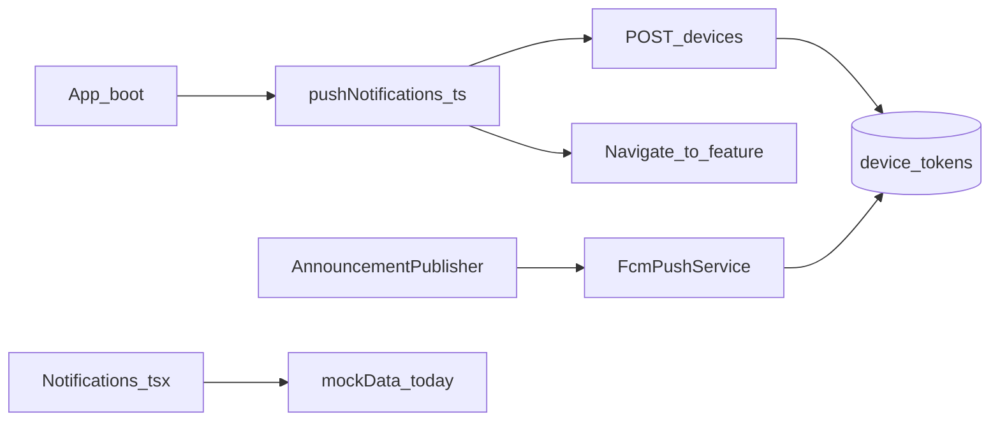
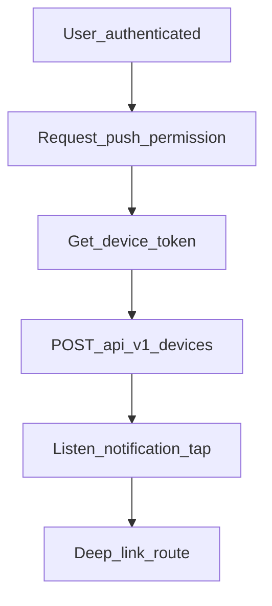

# Mobile — Notifications & Push

## Purpose

Registers the device for FCM/APNs push on app boot and deep-links into tickets/chat/ledger/notifications. The Notifications **list screen** still uses seed mock data; live `GET /notifications` exists on the backend but is not wired into that UI yet.

**Mobile UX:** Silent registration via `PushNotificationRegistration` in `App.tsx`; inbox at `/notifications` (partial mock); taps route into feature screens. Profile may show preference toggles (also partially unwired).

**Owning Laravel API:** `DeviceTokenController` (`POST|DELETE /devices` / device-tokens); `NotificationController` (`GET /notifications`, mark read); `NotificationPreferenceController` (`GET|PUT /notification-preferences`). Staff broadcast via announcements / `FcmPushService` on web.

## Users / entry points

| Who | Where |
|-----|--------|
| All authenticated sessions | `PushNotificationRegistration` in `App.tsx` |
| Members | `/notifications` (inbox UI — partial mock) |

## Context diagram

## Process flowchart — register

## File map

| Layer | Path |
|-------|------|
| Logic | `notifications/pushNotifications.ts` |
| API | `api/notifications.ts` |
| UI | `pages/Notifications.tsx` |
| Boot | `App.tsx` (`PushNotificationRegistration`) |
| Partial mock | `data/mockData.ts` |

## Routes / API

Mobile: `/notifications`.

Backend: `POST|DELETE /devices` (and `/device-tokens`); `GET /notifications`; mark read; `GET|PUT /notification-preferences`.

## Backend link

- Laravel: `DeviceTokenController`, `NotificationController`, `NotificationPreferenceController`
- Web: [Announcements](../web/announcements.md)

## Deeper explanation

**Screen / state pattern:** Registration is side-effectful on auth: permission → platform token → `POST /devices`. Tap handlers map payload types to Ionic routes (ticket, chat, ledger, inbox). The inbox page currently renders `mockData` seeds — treat as placeholder until wired to `GET /notifications`.

**API client:** `api/notifications.ts` should already expose device + inbox + preferences helpers; UI adoption is the gap. Unregister/delete device token on logout to avoid notifying the wrong user on shared devices.

**Offline / mock:** Push registration needs network once; inbox mock works offline but is not trustworthy. Deep links must wait for auth + membership hydration before navigating into gated tabs.

**Membership gate impact:** Device registration can run when authenticated; opening deep-linked member features still hits the membership gate. Prefer queuing the intended route until `MembershipContext` is ready.

## Scenarios

### Register device after login

- **Actor:** Newly authenticated member granting notification permission.
- **Steps:** Auth succeeds → `PushNotificationRegistration` → permission → token → `POST /devices`.
- **Expected result:** Token stored server-side; future announcements/ticket pushes can deliver.
- **Files involved:** `App.tsx`, `pushNotifications.ts`, `api/notifications.ts`, `DeviceTokenController`.

### Tap push to open ticket

- **Actor:** Member receiving a ticket update push.
- **Steps:** Tap notification → handler parses id → navigate `/tickets/:id` (after gates).
- **Expected result:** Correct ticket detail; if unlinked/unauth, gate then continue or drop gracefully.
- **Files involved:** `pushNotifications.ts`, `App.tsx`, `TicketDetail.tsx`, membership/auth contexts.

### Open notifications inbox (current)

- **Actor:** Member opening `/notifications`.
- **Steps:** Navigate to inbox → UI reads seed `mockData` today.
- **Expected result:** Placeholder list; developers should not treat items as live until `GET /notifications` is wired + mark-read works.
- **Files involved:** `Notifications.tsx`, `data/mockData.ts`, (target) `api/notifications.ts`.

## Developer discussion

1. Priority: wire inbox to `GET /notifications` + mark-read before go-live?
2. On logout, do we always `DELETE` the device token, and what if the call fails?
3. How are deep-link routes queued until onboarding/auth/membership finish hydrating?
4. Align Profile toggles with `/notification-preferences` categories used by FCM topics/announcements.
5. How do we test APNs vs FCM in Capacitor without leaking production server keys into the mobile repo?

## Related modules

- [Profile](profile.md)
- [Tickets](tickets.md)
- [Support Chat](support-chat.md)
- [Home](home-dashboard.md)
