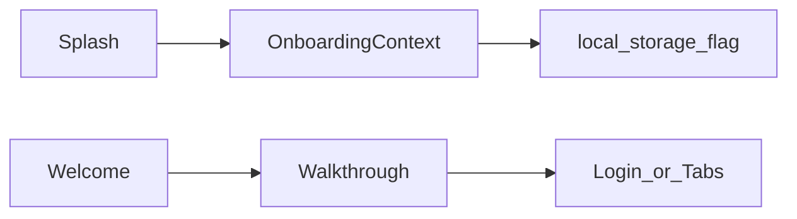
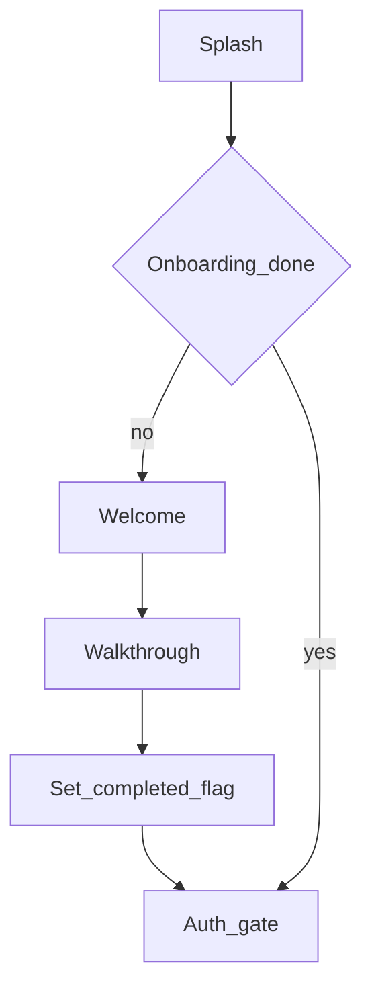

# Mobile — Onboarding

## Purpose

First-run splash, welcome, and walkthrough that introduce myASELCO before auth. Completion is a **local Preferences flag** — this module does not call Laravel.

**Mobile UX:** Timed splash → branded welcome → swipeable walkthrough slides; haptics on key taps. Returning installs skip the walkthrough when the completion flag is set.

**Owning Laravel API:** None. After local completion, routing hands off to [Auth](auth.md) (`/login` / `/register`) and then the membership gate.

## Users / entry points

| Who | Where |
|-----|--------|
| New installs | Splash → Welcome → Walkthrough |
| Returning | Splash skips walkthrough if completed |

## Context diagram

## Process flowchart

## File map

| Layer | Path |
|-------|------|
| UI | `pages/onboarding/Splash.tsx`, `Welcome.tsx`, `Walkthrough.tsx` |
| State | `onboarding/OnboardingContext.tsx`, `storage.ts`, `haptics.ts` |
| Data | `data/walkthroughSlides.ts` |
| API | None |

## Routes / API

Routes: `/welcome`, `/walkthrough` (plus splash gate in `App.tsx`). No backend endpoints.

## Backend link

None — local only. After completion, flow continues to [Auth](auth.md).

## Deeper explanation

**Screen / state pattern:** `OnboardingContext` hydrates `aselco_onboarding_complete` from storage, enforces a minimum splash duration, and exposes `needsOnboarding` / `completeOnboarding`. `App.tsx` uses that flag together with auth and membership to decide the first navigable route.

**API client:** Not used. Slide copy lives in `data/walkthroughSlides.ts` so product can edit messaging without backend deploys.

**Offline / mock:** Fully offline by design. Clearing app storage (or reinstall) resets onboarding even if the user still has a valid Sanctum token in Preferences — treat storage keys carefully during logout/debug.

**Membership gate impact:** Onboarding never bypasses membership. Completing the walkthrough only unlocks the auth gate; linked accounts are still required before main tabs.

**Auth interaction:** If the user is already authenticated when onboarding state loads, context may mark onboarding complete to avoid trapping a logged-in user in the walkthrough.

## Scenarios

### Fresh install walkthrough

- **Actor:** New customer after installing from store.
- **Steps:** Splash minimum time → Welcome CTA → Walkthrough slides → complete → flag saved → Login/Register.
- **Expected result:** Walkthrough does not show again on next cold start; auth screens are reachable.
- **Files involved:** `Splash.tsx`, `Welcome.tsx`, `Walkthrough.tsx`, `OnboardingContext.tsx`, `onboarding/storage.ts`, `App.tsx`.

### Returning install skips walkthrough

- **Actor:** User who finished onboarding previously.
- **Steps:** Splash → completion flag true → auth check (login or restore session).
- **Expected result:** No welcome/walkthrough; flow matches auth + membership gates only.
- **Files involved:** `OnboardingContext.tsx`, `App.tsx`.

### Storage cleared mid-session (debug / OS wipe)

- **Actor:** Developer or user clearing app data.
- **Steps:** Preferences wiped → app relaunch → onboarding flag missing.
- **Expected result:** Walkthrough appears again even if Laravel user still exists; user must re-auth if token was cleared too.
- **Files involved:** `onboarding/storage.ts`, `tokenStorage.ts`, `App.tsx`.

## Developer discussion

1. Should onboarding completion be tied to the Laravel user id so a reinstall on the same account can skip slides?
2. Is the splash minimum duration still right for slow devices, or does it feel like artificial delay?
3. How do we version walkthrough slides when marketing copy changes — force re-show once, or never?
4. Should haptics be optional via a system accessibility setting?
5. What is the intended order when both `needsOnboarding` and an existing token are true after a partial Preferences wipe?

## Related modules

- [Auth](auth.md)
- [Membership](membership.md)
