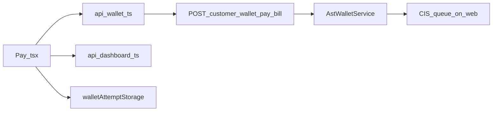
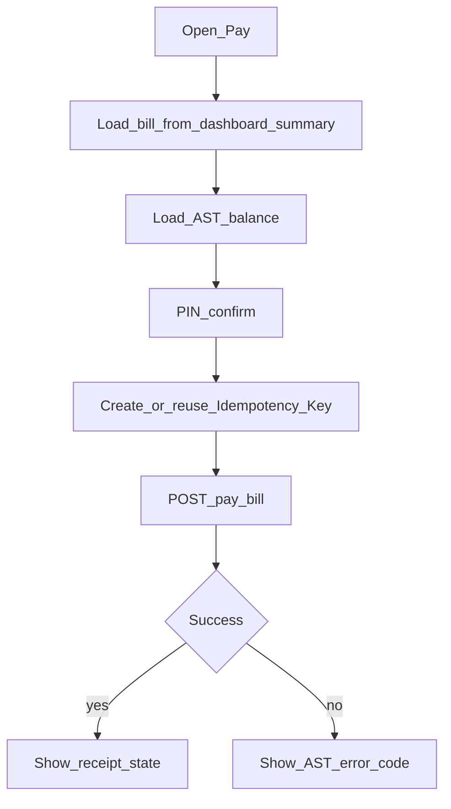

# Mobile — Pay with AST

## Purpose

Center tab to pay the current electric bill using AST for a matching linked account. Confirms with PIN UI, sends an Idempotency-Key, and handles AST-specific error codes so retries are safe and CIS settlement can proceed on the web side.

**Mobile UX:** `/tabs/pay` loads bill context + AST balance, confirms via PIN, shows success/receipt or mapped AST errors. Home quick action deep-links here.

**Owning Laravel API:** `CustomerWalletController::payBill` — `POST /api/v1/customer/wallet/pay-bill` with body `{ billing_id, amount, idempotency_key }` and `Idempotency-Key` header. Alternate `POST /wallet/pay` exists; mobile should stick to the customer pay-bill client used in `api/wallet.ts`. Downstream CIS queue is staff/web (`AstWalletService`).

## Users / entry points

| Who | Where |
|-----|--------|
| Linked members | `/tabs/pay` |
| Home quick action | Navigates to Pay |

## Context diagram

## Process flowchart

Common error codes: `AST_INSUFFICIENT_FUNDS`, `AST_BILL_ALREADY_PAID`, `AST_BILL_NOT_FOUND`, `AST_AMOUNT_MISMATCH`, `AST_IDEMPOTENCY_REQUIRED`.

## File map

| Layer | Path |
|-------|------|
| UI | `pages/Pay.tsx` |
| API | `api/wallet.ts` (`getCustomerWalletBalance`, `payBillWithAst`), `api/dashboard.ts` |
| Local | `api/walletAttemptStorage.ts` |

## Routes / API

Mobile: `/tabs/pay`.

Backend: `POST /api/v1/customer/wallet/pay-bill` with body `{ billing_id, amount, idempotency_key }` and `Idempotency-Key` header.  
Alternate: `POST /wallet/pay` (account_number + amount).

## Backend link

- Laravel: `CustomerWalletController::payBill`
- Web CIS: [AST Wallet](../web/ast-wallet.md) (`/ast/cis-queue`)
- Billing context: [Consumers / Billing](../web/consumers-billing.md)

## Deeper explanation

**Screen / state pattern:** `Pay.tsx` composes dashboard summary (bill / billing_id / amount) with wallet balance. PIN is a client confirmation UX (not a separate Laravel PIN API unless added later). Before POST, the screen creates or reuses an idempotency key from `walletAttemptStorage` so retries after timeouts do not double-charge.

**API client:** `payBillWithAst` sets both body `idempotency_key` and `Idempotency-Key` header. Map Laravel AST error codes to member-readable messages; clear pending attempt storage only on definitive success or terminal business errors (already paid, etc.).

**Offline / mock:** Pay requires network. Do not mock a successful payment locally. Pending attempt persistence helps flaky networks but must never invent a receipt without server confirmation.

**Membership gate impact:** Unlinked users cannot open Pay. The billing account in the payload must belong to the member’s linked accounts; mismatches surface as AST/bill errors. After success, Ledger/Home/Wallet should refresh.

## Scenarios

### Happy-path bill payment

- **Actor:** Linked member with sufficient AST and an unpaid bill.
- **Steps:** Open Pay → load summary + balance → enter PIN → POST pay-bill with new Idempotency-Key → success UI → clear pending attempt.
- **Expected result:** AST debited; CIS queue item created on backend/web; receipt state shown.
- **Files involved:** `Pay.tsx`, `api/wallet.ts`, `api/dashboard.ts`, `walletAttemptStorage.ts`.

### Retry after uncertain network

- **Actor:** Member whose first POST timed out client-side.
- **Steps:** Reopen/retry Pay → detect pending key in `walletAttemptStorage` → reuse same Idempotency-Key → POST again.
- **Expected result:** Server returns original success or consistent error; no double payment.
- **Files involved:** `Pay.tsx`, `walletAttemptStorage.ts`, `api/wallet.ts`, Laravel payBill + AstWalletService.

### Insufficient funds / already paid

- **Actor:** Member with low AST or stale bill context.
- **Steps:** Confirm → POST → API returns `AST_INSUFFICIENT_FUNDS` or `AST_BILL_ALREADY_PAID`.
- **Expected result:** Clear error copy; no fake success; refresh summary so UI catches up.
- **Files involved:** `Pay.tsx`, `api/wallet.ts`, `api/dashboard.ts`.

## Developer discussion

1. Is PIN only UX friction, or should it bind to a server-side verification step?
2. Which AST error codes are terminal (clear attempt) vs retryable (keep key)?
3. How do we keep `billing_id` + `amount` in sync if the bill changes between screen open and POST?
4. Should Pay block when membership has multiple accounts until the user explicitly picks one?
5. What telemetry do we need around idempotency reuse for support debugging?

## Related modules

- [AST Wallet](ast-wallet.md)
- [Ledger](ledger.md)
- [Home](home-dashboard.md)
