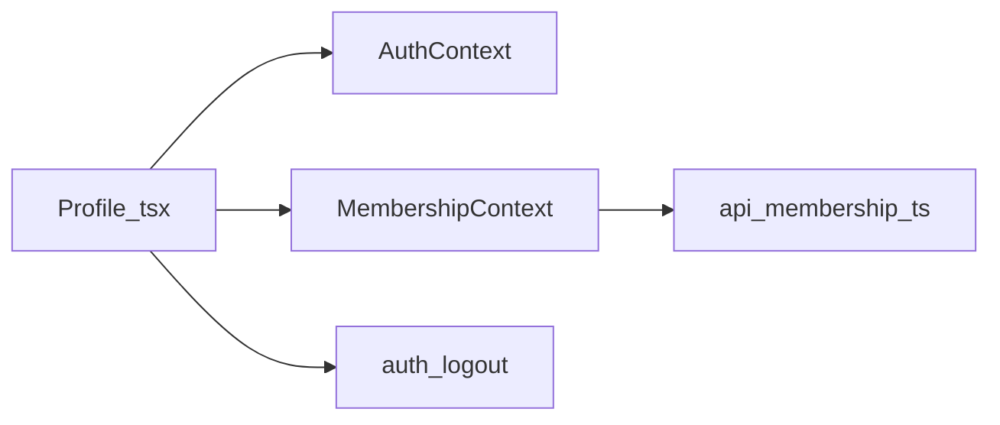
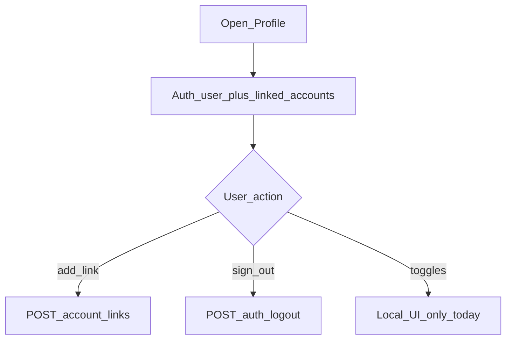

# Mobile — Profile

## Purpose

Shows member/service info, linked accounts, add-link affordances, local notification toggles UI, and sign out. Profile is the settings/account hub after membership is established — not a second auth screen.

**Mobile UX:** `/tabs/profile` with identity summary, linked accounts list, navigation into membership add-link, preference toggles (partially local today), and logout.

**Owning Laravel API:** Membership endpoints via `MembershipController` for linked accounts / add link; `AuthController` for `POST /auth/logout`. Notification preference `GET|PUT /notification-preferences` exists on backend but Profile toggles may not be fully wired yet. Staff see the same customers under web Access / Consumers.

## Users / entry points

| Who | Where |
|-----|--------|
| Linked members | `/tabs/profile` |

## Context diagram

## Process flowchart

Note: notification toggles are not fully wired to `GET|PUT /notification-preferences` yet.

## File map

| Layer | Path |
|-------|------|
| UI | `pages/Profile.tsx` |
| State | `auth/AuthContext.tsx`, `membership/MembershipContext.tsx` |
| Utils | `utils/serviceAccount.ts` |
| API | membership + auth logout |

## Routes / API

Mobile: `/tabs/profile`.

Backend: membership endpoints + `POST /auth/logout`. Preferences API exists but Profile may not call it yet.

## Backend link

- Laravel: `MembershipController`, `AuthController`
- Web: [Access](../web/access-user-management.md) (staff view of customers), [Consumers / Billing](../web/consumers-billing.md)

## Deeper explanation

**Screen / state pattern:** Profile composes `AuthContext` user fields with `MembershipContext` linked accounts. Add-link routes into membership setup (`?add=1`). Logout goes through auth context (token clear + cache clear). Some display fields may still lean on `mockData` member placeholders — prefer live `AuthUser` / membership payloads.

**API client:** No dedicated `api/profile.ts`; reuse auth + membership modules. Wire notification preferences through `api/notifications.ts` when finishing the toggles.

**Offline / mock:** Linked accounts need network to refresh; logout should work and clear local session even if logout POST fails (decide product policy). Preference toggles that only flip local state will not survive reinstall until API-backed.

**Membership gate impact:** Profile tab is for linked members. Unlinked users live on MembershipSetup instead. Adding links from Profile still uses the same membership APIs as first-time setup.

## Scenarios

### View linked accounts

- **Actor:** Linked member.
- **Steps:** Open Profile → membership context supplies accounts → list renders.
- **Expected result:** Account numbers match `/membership/linked-accounts`; no stale mock-only identities for account list.
- **Files involved:** `Profile.tsx`, `MembershipContext.tsx`, `api/membership.ts`.

### Add another service account

- **Actor:** Multi-property member.
- **Steps:** Tap add → `/membership/setup?add=1` → privacy + POST link → return/refresh Profile.
- **Expected result:** New link pending or active per status; Ledger/Pay pickers update after ready.
- **Files involved:** `Profile.tsx`, `MembershipSetup.tsx`, `MembershipContext.tsx`.

### Sign out

- **Actor:** Member finished on a shared device.
- **Steps:** Sign out → `POST /auth/logout` → clear token/caches → login screen.
- **Expected result:** No access to tabs; next user must authenticate; ledger/wallet attempt caches cleared.
- **Files involved:** `Profile.tsx`, `AuthContext.tsx`, `api/auth.ts`, `ledgerStorage.ts`.

## Developer discussion

1. Which Profile fields still come from `mockData.member`, and can we delete that dependency?
2. Finish wiring notification toggles to `/notification-preferences` — default values on first load?
3. Should Profile expose email resend / change-password if Auth API supports it?
4. How do we show pending vs approved account links clearly?
5. Offline logout policy: clear local session immediately even when logout API fails?

## Related modules

- [Membership](membership.md)
- [Auth](auth.md)
- [Notifications](notifications.md)
