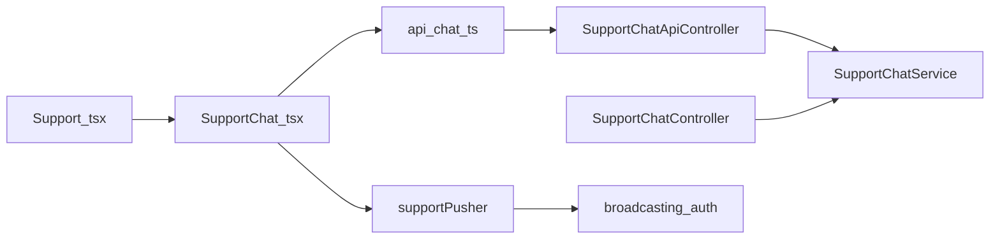
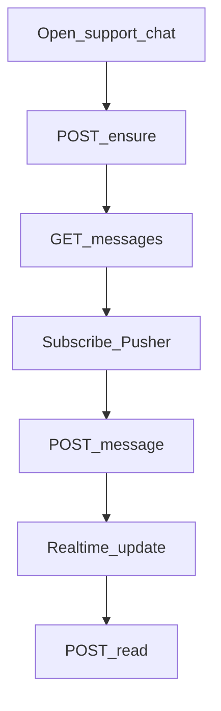

# Mobile — Support Hub & Live Chat

## Purpose

Support hub (contact/FAQ) plus realtime human chat with staff via Pusher. Chat is API-backed; some hub contact/FAQ copy still comes from mock data. Use this when the member wants a live agent rather than AI or a formal complaint ticket.

**Mobile UX:** `/support` hub → `/support/chat` conversation. Home quick action can jump to Support. Messages sync through REST + Pusher events; read receipts via POST read.

**Owning Laravel API:** `SupportChatApiController` + `SupportChatService` — ensure session, get chat, messages GET/POST, read. Broadcast auth at `{origin}/broadcasting/auth`. Staff reply on web Support Chat.

## Users / entry points

| Who | Where |
|-----|--------|
| Linked members | `/support`, `/support/chat` |
| Home quick action | Support |

## Context diagram

## Process flowchart

## File map

| Layer | Path |
|-------|------|
| UI | `pages/Support.tsx`, `SupportChat.tsx` (+ CSS) |
| API | `api/chat.ts` |
| Realtime | `realtime/supportPusher.ts` |
| Partial mock | `data/mockData.ts` (FAQ/contact on hub) |

## Routes / API

Mobile: `/support`, `/support/chat`.

Backend: `POST /customer/support-chat/ensure`; `GET /customer/support-chat`; `GET|POST .../messages`; `POST .../read`.  
Broadcast: `{origin}/broadcasting/auth`.

## Backend link

- Laravel: `Api/V1/SupportChatApiController.php`, `SupportChatService`
- Web: [Support Chat](../web/support-chat.md)

## Deeper explanation

**Screen / state pattern:** Hub (`Support.tsx`) is mostly static/mock contact+FAQ today. Chat page ensures a support session, loads history, subscribes via `supportPusher.ts`, and posts messages. Read receipts fire as the member views agent messages.

**API client:** `api/chat.ts` for REST; Pusher client uses Sanctum-authenticated broadcasting auth. Reconnect strategy matters when the app backgrounds on mobile OS.

**Offline / mock:** FAQ/contact on the hub still use `mockData.ts` — replace with CMS/API when available. Live chat cannot work fully offline; show reconnect/disabled send when subscription fails. Do not mix mock FAQ answers into the chat transcript.

**Membership gate impact:** Support routes require linked membership. Chat is complementary to AI and Tickets: escalate/complaint create tickets; chat is synchronous human messaging.

## Scenarios

### Start live chat

- **Actor:** Linked member needing an agent.
- **Steps:** Open Support → Chat → `POST ensure` → load messages → subscribe Pusher → send first message.
- **Expected result:** Message persists via API and appears for staff on web; realtime echo on device.
- **Files involved:** `SupportChat.tsx`, `api/chat.ts`, `supportPusher.ts`, `SupportChatApiController`.

### Receive staff reply in realtime

- **Actor:** Member waiting in chat.
- **Steps:** Staff sends from web → broadcast → mobile listener appends → optional `POST read`.
- **Expected result:** Reply appears without manual refresh; unread state clears after read.
- **Files involved:** `supportPusher.ts`, `SupportChat.tsx`, web Support Chat, broadcasting auth.

### Browse hub FAQ (mock)

- **Actor:** Member checking hours/contact before chatting.
- **Steps:** Open `/support` → read FAQ/contact from current mock sources.
- **Expected result:** Informative hub; user understands chat is separate; mock content labeled or replaced before go-live if required.
- **Files involved:** `Support.tsx`, `data/mockData.ts`.

## Developer discussion

1. When do we replace hub FAQ/contact mock with CMS or API content?
2. What is the reconnect/backoff policy if Pusher drops on cellular handoff?
3. Should ensure create a new thread daily or resume the same open chat indefinitely?
4. How are after-hours messages queued for staff — member-visible expectations?
5. Do push notifications duplicate Pusher events, and how do we dedupe in UI?

## Related modules

- [AI Assistant](ai-assistant.md)
- [Tickets](tickets.md)
- [Home](home-dashboard.md)
