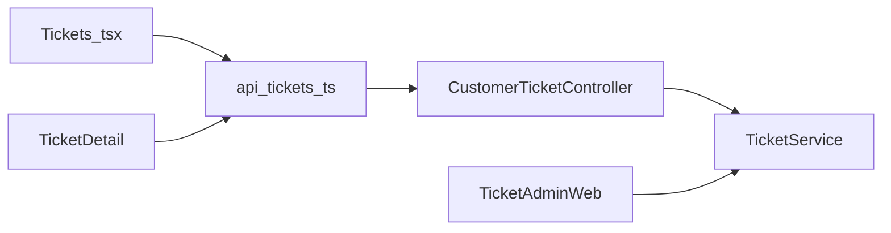
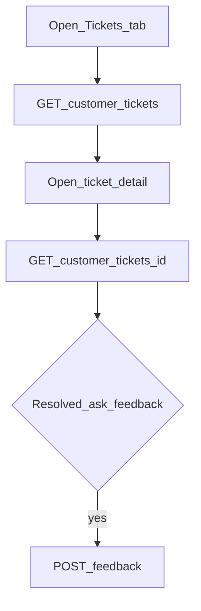

# Mobile — Tickets

## Purpose

List the member’s tickets, open detail/timeline, and submit resolution feedback. Creation is a separate Complaints flow; this module is the inbox + detail experience over the shared tickets backend staff use on web.

**Mobile UX:** `/tabs/tickets` list; `/tickets/:id` detail with status/timeline; feedback prompt when resolved. Push deep-links can open detail.

**Owning Laravel API:** `CustomerTicketController` — `GET /customer/tickets`, `GET /customer/tickets/{id}`, `POST /customer/tickets/{id}/feedback`. Staff triage uses the web Tickets module / `TicketService`.

## Users / entry points

| Who | Where |
|-----|--------|
| Linked members | `/tabs/tickets`, `/tickets/:id` |
| Create flow | [Complaints](complaints.md) → `/complaints` |

## Context diagram

## Process flowchart

## File map

| Layer | Path |
|-------|------|
| UI | `pages/Tickets.tsx`, `TicketDetail.tsx` |
| API | `api/tickets.ts` |
| Types | `CustomerTicketListItem`, `CustomerTicketDetail`, … |

## Routes / API

Mobile: `/tabs/tickets`, `/tickets/:id`.

Backend: `GET /customer/tickets`, `GET /customer/tickets/{id}`, `POST /customer/tickets/{id}/feedback`.

## Backend link

- Laravel: `Api/V1/CustomerTicketController.php`
- Web: [Tickets](../web/tickets.md)

## Deeper explanation

**Screen / state pattern:** List page fetches customer tickets on enter/refresh; detail fetches by id for timeline/messages. Feedback is a POST when status allows. Types in `types.ts` should mirror customer ticket resources, not staff admin DTOs.

**API client:** `api/tickets.ts` also serves Complaints (create/attachments). Keep list/detail/feedback here; avoid calling admin ticket routes from the mobile client.

**Offline / mock:** Tickets are live API. Empty list is a valid state. Do not seed fake tickets in production UI. Deep links from push should tolerate 404 if the ticket was deleted.

**Membership gate impact:** Tickets tab requires linked membership like other main tabs. AI escalate and Complaints create tickets that appear here after refresh.

## Scenarios

### Browse open tickets

- **Actor:** Linked member with prior complaints.
- **Steps:** Open Tickets tab → `GET /customer/tickets` → tap item → detail GET.
- **Expected result:** Status/timeline match staff web ticket; member sees customer-safe fields only.
- **Files involved:** `Tickets.tsx`, `TicketDetail.tsx`, `api/tickets.ts`.

### Submit resolution feedback

- **Actor:** Member whose ticket is resolved.
- **Steps:** Open detail → feedback UI → `POST .../feedback`.
- **Expected result:** Feedback stored; UI confirms; staff can see rating/comments on web.
- **Files involved:** `TicketDetail.tsx`, `api/tickets.ts`, `CustomerTicketController`.

### Arrive from push / notification

- **Actor:** Member tapping a ticket push.
- **Steps:** Deep link to `/tickets/:id` → membership/auth gates → detail load.
- **Expected result:** Lands on correct ticket when session + membership ready; otherwise gate then continue.
- **Files involved:** `pushNotifications.ts`, `App.tsx`, `TicketDetail.tsx`.

## Developer discussion

1. Should the list poll or rely on pull-to-refresh / push invalidation after staff updates?
2. Are customer-visible timeline events filtered consistently with web privacy rules?
3. What happens if feedback is submitted twice — idempotent or error?
4. How do AI-escalated tickets appear differently (labels) from Complaints-created ones?
5. Do we need optimistic UI when returning from Complaints create?

## Related modules

- [Complaints](complaints.md)
- [AI Assistant](ai-assistant.md) — escalate may create tickets
- [Notifications](notifications.md)
