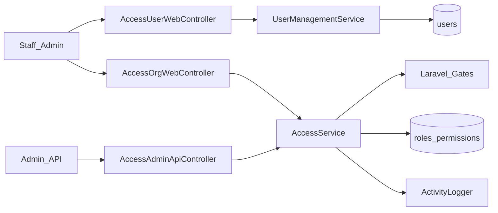
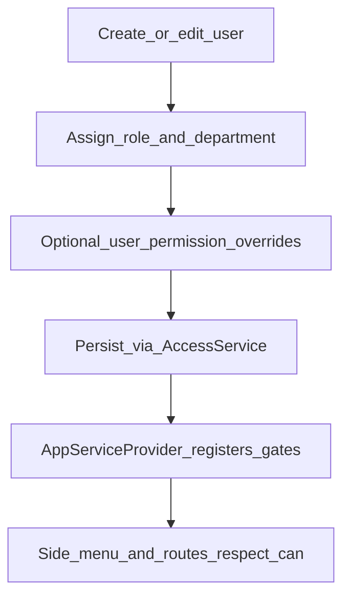

# Web — Access / User Management

## Purpose

Central staff module for users, customers, support agents, departments, roles, permission matrix, sessions, activity, availability, assignments, settings, and access reports. Gates every other staff feature through `config/access.php` permission codes.

Deeper reference: [aselcoph/docs/user-management.md](../../aselcoph/docs/user-management.md).

Access is the control plane for who can see and change everything else in the staff portal. Creating a user without the right role/department breaks ticket assignment and menu visibility; editing permissions without understanding gates breaks APIs that check `can.permission:*` or module codes. Web UI under `/access/*` and admin APIs under `/api/v1/admin/*` should stay aligned with `AccessService` / `UserManagementService`.

Mobile auth creates or returns users via Sanctum, but staff org structure, workload, and fine-grained module permissions are owned here. Optional AI assignment (`ACCESS_AI_ASSIGNMENT`) only influences ticket assign paths — it does not replace role gates.

## Deeper explanation

- **Key concepts:** Roles and permissions catalog in `config/access.php`; optional per-user overrides (`UserPermission`); departments; availability/skills/schedules for assignment; sessions and activity for security ops; Laravel Gates registered from access config.
- **Invariants:** Side menus and write routes must respect `can` / permission middleware, not only Blade `@if(role)`; default role on register comes from `ACCESS_DEFAULT_ROLE`; activity logging should capture sensitive access changes.
- **Common pitfalls:** Hard-coding role names in new controllers; granting `permissions` edit without audit; treating customer records here as a full billing CIS substitute; enabling MFA/lockout env flags without testing staff login flows.

## Users / entry points

| Who | Where |
|-----|--------|
| Admins / HR-style staff | `/access/users`, `/access/customers`, `/access/support` |
| Org admins | `/access/departments`, `/roles`, `/permissions` |
| Security | `/access/sessions`, `/access/activity` |
| Ops | `/access/availability`, `/assignments`, `/settings`, `/reports` |

## Context diagram

## Process flowchart — grant access

## File map (MVC + Services + AI)

| Layer | Path |
|-------|------|
| Controllers | `Access/AccessUserWebController.php`, `Access/AccessOrgWebController.php` |
| | `Api/Admin/AccessAdminApiController.php`, `UserController.php` |
| Models | `User.php`, `Role.php`, `Permission.php`, `UserPermission.php`, `Department.php` |
| | `UserProfile.php`, `UserAvailability.php`, `UserSchedule.php`, `UserSkill.php` |
| | `UserActivityLog.php`, `AccessSetting.php` |
| Services | `Services/Access/AccessService.php`, `UserManagementService.php`, `ActivityLogger.php` |
| Views | `aselcoph/resources/views/pages/staff/access/*` including `membership-application.blade.php` |
| Config | `aselcoph/config/access.php` |
| AI | Optional assignment assist via `ACCESS_AI_ASSIGNMENT` (ticket assign path) |

## Routes / API

### Web (`access.*`)

`/access/users`, `/customers`, `/support`, departments, roles, permissions, sessions, activity, availability, assignments, settings, reports — see `routes/web.php` access group.

### API (`/api/v1`)

| Path | Notes |
|------|--------|
| `/admin/users`, `/departments`, `/roles`, `/permissions` | CRUD-ish |
| `/admin/tickets/{id}/assign\|reassign` | Assignment |
| `/support/tickets`, `/support/dashboard`, `/support/profile` | Agent support API |

## Permissions / feature flags

Module catalog in `config/access.php`: `users`, `departments`, `roles`, `permissions`, `settings`, `audit`, `sessions`, plus feature modules (`tickets`, `wallet`, `ai`, …).

Env: `ACCESS_DEFAULT_ROLE`, lockout, MFA staff, max workload, AI assignment.

## Scenarios

### Scenario A — Create staff user and grant role

- **Actor:** Access admin
- **Steps:**
  1. Create/edit user under `/access/users`.
  2. Assign role and department.
  3. Optionally set permission overrides; save.
- **Expected result:** Gates and menus reflect new access; activity log records the change.
- **Where in code:** `AccessUserWebController` → `UserManagementService` / `AccessService`; `config/access.php`.

### Scenario B — Adjust permission matrix

- **Actor:** Org admin
- **Steps:**
  1. Open `/access/permissions` (and roles as needed).
  2. Toggle module codes (e.g. `tickets.*`, `wallet.*`).
  3. Verify a test staff session sees updated menus/API authorization.
- **Expected result:** Middleware `can.permission:*` and catalog codes agree; no orphan routes without a permission story.
- **Where in code:** `AccessOrgWebController`, `AccessAdminApiController`, Gate registration.

### Scenario C — Agent availability and ticket assign

- **Actor:** Supervisor / assigner
- **Steps:**
  1. Set availability under `/access/availability`.
  2. Use assignments UI or ticket assign/reassign APIs.
  3. Confirm workload / AI assignment flags behave as configured.
- **Expected result:** Assignments respect availability and permissions; AI assignment only when `ACCESS_AI_ASSIGNMENT` allows.
- **Where in code:** Access models `UserAvailability`, `UserSkill`; ticket assign routes under `/admin/tickets/{id}/assign|reassign`.

## Developer discussion

- Did you add new permission codes to `config/access.php` and wire middleware/menus, not only Blade role checks?
- Are web and `/api/v1/admin/*` authorization rules equivalent for the same action?
- Sensitive changes (roles, permissions, sessions): is `ActivityLogger` covering them?
- What is the blast radius if `ACCESS_DEFAULT_ROLE` or MFA/lockout env changes?
- Do not break: existing staff login, ticket assign pools, wallet load role lists that read access config.

## Related modules

- [Support Workspace](support-workspace.md)
- [Tickets](tickets.md)
- [Auth & Profile](auth-profile.md)
- [Consumers / Billing](consumers-billing.md) — customer records overlap
