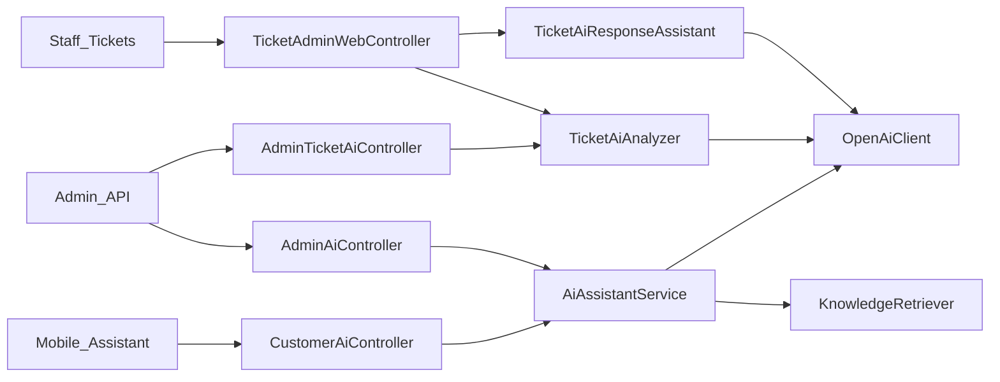
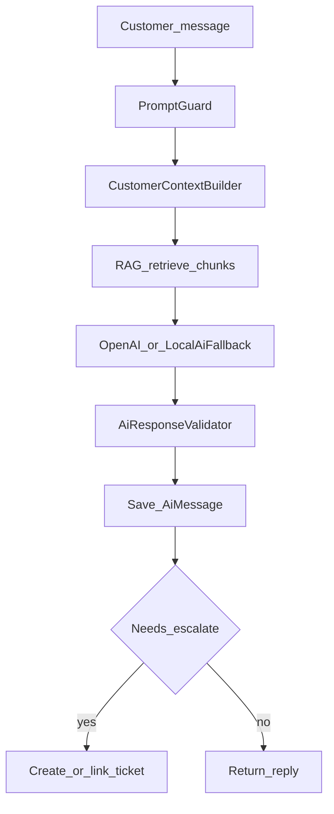
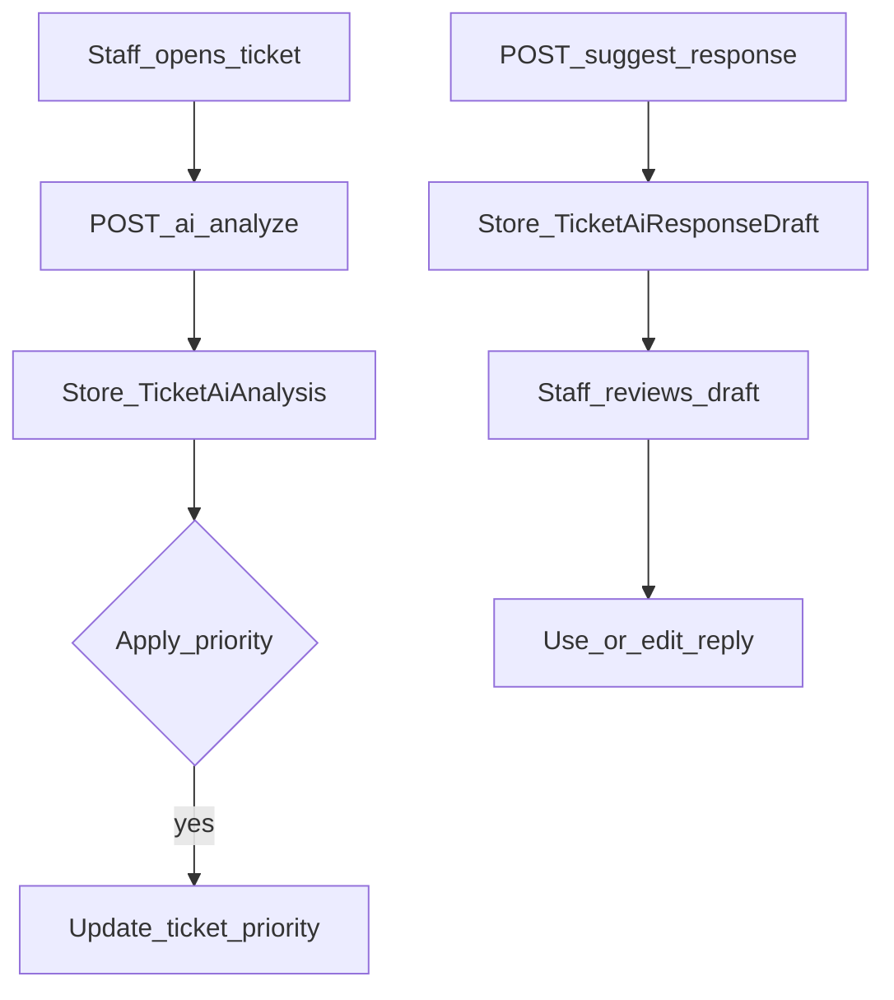

# Web — AI Assistant & Ticket AI

## Purpose

Server-side AI for (1) customer assistant chat on mobile, (2) staff CSR assist, and (3) ticket analysis / draft replies. All OpenAI calls stay in Laravel services — never from the mobile client with an API key. Answers for customer chat are grounded via the [Knowledge / RAG](knowledge-rag.md) pipeline when documents are indexed.

AI is a product layer on top of tickets and knowledge, not a separate app. Mobile only sends user text and receives replies/conversation IDs over `/api/v1/customer/ai/*`. Staff trigger analyze/suggest from ticket Blade screens or admin AI APIs. That design keeps keys, prompt guards, and retrieval policy in `Services/Ai` and `Services/Rag`.

When retrieval quality is poor, answers can drift; when escalation is detected, the flow may create or link a ticket instead of looping forever in chat. Feature flags (`AI_ENABLED`, access codes like `ai.chat`) and throttles (`throttle:api-ai`) are first-class controls — treat them as part of the contract when enabling AI in an environment.

## Deeper explanation

- **Key concepts:** Conversations/messages as chat state; `AiAssistantService` as the customer path orchestrator; ticket analyzer vs response assistant as staff helpers; PromptGuard / AiResponseValidator as safety rails; LocalAiFallback when primary completion is unavailable; RAG retrieval as optional grounding, not optional key storage.
- **Invariants:** No OpenAI key in mobile or Blade JS; staff AI writes go through audited/admin paths where modeled (`AiAdminAuditLog`, request logs); escalation is explicit via detector + escalate endpoints, not silent ticket spam; ticket AI drafts are reviewed before use.
- **Common pitfalls:** Calling OpenAI from a new controller instead of `OpenAiClient` / contracts; skipping RAG when knowledge is expected; applying ticket priority from analysis without the apply-priority step; forgetting throttle groups on new AI routes.

## Users / entry points

| Who | Where |
|-----|--------|
| Members | Mobile `/assistant` → `/api/v1/customer/ai/*` |
| Ticket staff | `/tickets/ai`, ticket detail AI buttons |
| Knowledge testers | `/knowledge/chat`, `/knowledge/test` |
| Admin API | `/api/v1/admin/ai/assist`, `/admin/tickets/{id}/ai/*` |

## Context diagram

## Process flowchart — customer chat

## Process flowchart — ticket AI assist

## File map (MVC + Services + AI)

| Layer | Path |
|-------|------|
| Controllers | `Api/V1/CustomerAiController.php` |
| | `Api/Admin/AdminAiController.php` |
| | `Api/Admin/AdminTicketAiController.php` |
| | AI actions also on `TicketAdminWebController.php`, `KnowledgeAdminWebController.php` |
| Models | `AiConversation.php`, `AiMessage.php`, `AiRequestLog.php`, `AiAdminAuditLog.php` |
| | `TicketAiAnalysis.php`, `TicketAiResponseDraft.php` |
| Services (`Services/Ai/`) | `AiAssistantService.php`, `OpenAiClient.php` |
| | `TicketAiAnalyzer.php`, `TicketAiResponseAssistant.php` |
| | `ConversationCoach.php`, `EscalationDetector.php`, `CustomerContextBuilder.php` |
| | `LocalAiFallback.php`, `PromptGuard.php`, `AiResponseValidator.php` |
| | `Contracts/AiCompletionClient.php` |
| RAG link | `Services/Rag/*` (see Knowledge doc) |
| Config | `aselcoph/config/ai.php` (`AI_ENABLED`, OpenAI keys/models) |
| Views | Ticket AI dashboard under `pages/staff/tickets/`; knowledge chat under `pages/staff/knowledge/` |

## Routes / API

| Surface | Paths |
|---------|--------|
| Web | `GET /tickets/ai`; `POST /tickets/{id}/ai/analyze\|apply-priority\|suggest-response`; draft review |
| | Knowledge chat: `/knowledge/chat`, `/knowledge/test` |
| API customer | `GET /customer/ai/bootstrap`; `POST /chat`, `/inquiry`, `/search`, `/escalate` |
| | `GET\|DELETE /customer/ai/conversations[/{id}]` |
| API admin | `POST /admin/ai/assist`; `/admin/tickets/.../ai/*`; `GET /admin/tickets/ai/dashboard` |

## Permissions / feature flags

| Key | Notes |
|-----|--------|
| `ai.chat`, `ai.ticket-analysis.view`, `ai.response-suggestions` | Staff AI features |
| `ai.knowledge.manage`, `ai.settings.manage` | Knowledge / settings |
| `AI_ENABLED` | Master toggle in `config/ai.php` |
| `ACCESS_AI_ASSIGNMENT` | Optional AI-assisted ticket assignment |
| Throttle | `throttle:api-ai` on AI API groups |

## Scenarios

### Scenario A — Member chats with the assistant

- **Actor:** Mobile member
- **Steps:**
  1. App loads bootstrap via `GET /customer/ai/bootstrap`.
  2. User sends a message via `POST .../chat` (or inquiry/search as implemented).
  3. Optional escalate via `POST .../escalate` when human handoff is needed.
- **Expected result:** Reply returned after guard → context → RAG → completion → validate → save; no API key leaves the server.
- **Where in code:** `CustomerAiController` → `AiAssistantService`, `PromptGuard`, `KnowledgeRetriever`, `OpenAiClient`.

### Scenario B — Staff analyzes a ticket and applies priority

- **Actor:** Ticket staff with AI analysis permission
- **Steps:**
  1. Open ticket detail; `POST /tickets/{id}/ai/analyze`.
  2. Review stored `TicketAiAnalysis`.
  3. Optionally `POST .../ai/apply-priority`.
- **Expected result:** Analysis persisted; priority changes only on apply; request/audit logs updated as designed.
- **Where in code:** `TicketAdminWebController` / `AdminTicketAiController` → `TicketAiAnalyzer`; model `TicketAiAnalysis`.

### Scenario C — Suggest reply draft

- **Actor:** Ticket staff with response-suggestions
- **Steps:**
  1. `POST .../ai/suggest-response`.
  2. Review `TicketAiResponseDraft` on the ticket AI UI.
  3. Edit and send as a normal ticket reply (human-owned).
- **Expected result:** Draft stored for review; not auto-posted as the customer-facing message without staff action.
- **Where in code:** `TicketAiResponseAssistant`; views under `pages/staff/tickets/`.

## Developer discussion

- Does any client-visible code path expose OpenAI keys or bypass `OpenAiClient` / `AiCompletionClient`?
- Are PromptGuard + AiResponseValidator still on the customer chat path after this change?
- How does this behave when `AI_ENABLED` is false or RAG returns zero hits?
- Ticket AI: is apply-priority gated separately from analyze, and are drafts clearly non-final?
- Cost/abuse: are new endpoints under `throttle:api-ai` and the right `ai.*` permission codes?

## Related modules

- [Knowledge / RAG](knowledge-rag.md) — grounding source
- [Tickets](tickets.md)
- [Mobile AI Assistant](../mobile/ai-assistant.md)
- Repo notes: `AI-Knowledge.md`, `AI-Knowledge-Structure.md` at repo root
