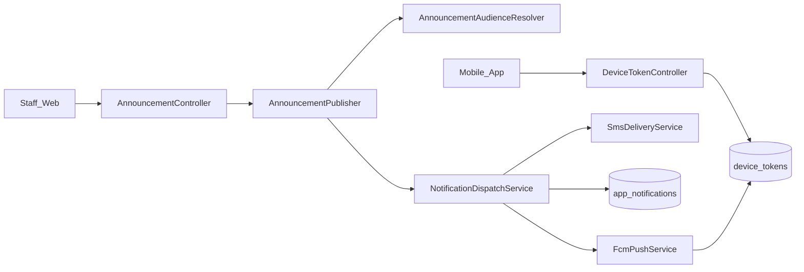
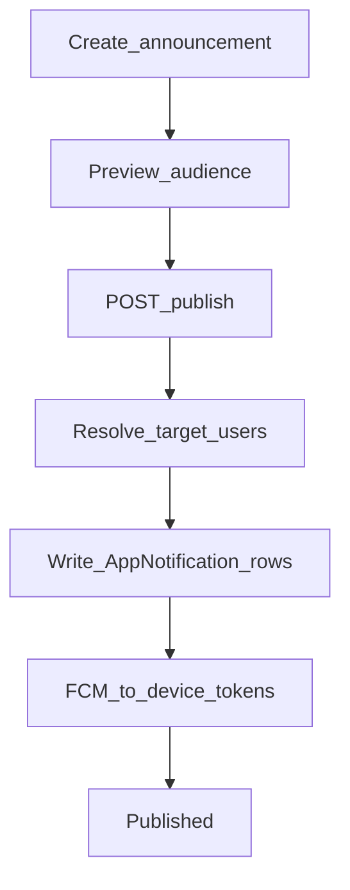

# Web — Announcements & Push Dispatch

## Purpose

Staff create, preview audience, and publish mobile announcements. Publishing resolves the audience, writes in-app notifications, and can dispatch FCM push (and SMS where configured) to registered devices.

Announcements are the broadcast channel for outages, reminders, and coop-wide messages. Staff author and preview on Blade; members receive via FCM and the notifications inbox API. Device tokens are registered from mobile boot (`POST /api/v1/devices`), so publish without tokens is a silent no-op for push even if in-app rows are written.

Keep publishing in `AnnouncementPublisher` + audience resolver + `NotificationDispatchService` so web UI never talks to FCM directly. Preferences (`NotificationPreference`) and admin notification APIs exist so members can opt down noise without staff bypassing the publisher pipeline.

## Deeper explanation

- **Key concepts:** Draft → preview audience → publish; audience resolution to user set; `AppNotification` rows for in-app; FCM via `FcmPushService` using `device_tokens`; optional SMS via `SmsDeliveryService`.
- **Invariants:** Preview should not send; publish is the side-effecting step; token registration is member-owned (`DeviceTokenController`); staff should not invent ad-hoc FCM sends outside dispatch services for announcement content.
- **Common pitfalls:** Publishing without preview on large audiences; missing Firebase/env config then assuming “push broken in app”; duplicating announcement text into unrelated notification writers; ignoring preference endpoints when adding new notification types.

## Users / entry points

| Who | Where |
|-----|--------|
| Staff publishers | `/announcements`, create/edit/publish |
| Members | Mobile push + (eventually) notifications inbox |
| Devices | `POST /api/v1/devices` from mobile boot |

## Context diagram

## Process flowchart — publish

## File map (MVC + Services + AI)

| Layer | Path |
|-------|------|
| Controllers | `AnnouncementController.php` |
| | `Api/V1/NotificationController.php`, `DeviceTokenController.php`, `NotificationPreferenceController.php` |
| Models | `Announcement.php`, `AppNotification.php`, `NotificationPreference.php`, `DeviceToken.php` |
| Services | `AnnouncementPublisher.php`, `AnnouncementAudienceResolver.php` |
| | `NotificationDispatchService.php`, `FcmPushService.php`, `SmsDeliveryService.php` |
| Views | `aselcoph/resources/views/pages/staff/announcements/*` |
| AI | None |

## Routes / API

### Web

`GET/POST /announcements`, create, edit, show, `preview-audience`, `publish`, `search-users`.

### API (`/api/v1`)

| Path | Notes |
|------|--------|
| `POST\|DELETE /devices` (and `/device-tokens`) | Register push token |
| `GET /notifications`, mark read / read-all | Inbox API |
| `GET\|PUT /notification-preferences` | Preferences |
| `/admin/notifications/*` | Staff notification API |

## Permissions / feature flags

- `notifications.view` in access catalog
- FCM credentials via env / Firebase config used by `FcmPushService`

## Scenarios

### Scenario A — Staff publishes after audience preview

- **Actor:** Staff publisher
- **Steps:**
  1. Create announcement under `/announcements`.
  2. Run `preview-audience` and confirm target set.
  3. Publish.
- **Expected result:** `AppNotification` rows created for targets; FCM attempted for registered tokens; SMS only if configured for that path.
- **Where in code:** `AnnouncementController` → `AnnouncementPublisher` → `AnnouncementAudienceResolver` → `NotificationDispatchService`.

### Scenario B — Mobile registers device then receives push

- **Actor:** Mobile member
- **Steps:**
  1. App registers token via `POST /api/v1/devices`.
  2. Staff publishes an announcement targeting that user.
  3. Member sees push and/or inbox via `GET /notifications`.
- **Expected result:** Token stored; dispatch finds token; mark-read works on inbox API.
- **Where in code:** `DeviceTokenController`, `FcmPushService`, `NotificationController`.

### Scenario C — Member updates notification preferences

- **Actor:** Mobile member
- **Steps:**
  1. `GET /notification-preferences`.
  2. `PUT` updated preferences.
  3. Subsequent publishes/dispatches respect preference rules as implemented.
- **Expected result:** Preferences persisted; dispatch path consults them rather than ignoring the API.
- **Where in code:** `NotificationPreferenceController`, `NotificationPreference` model, dispatch services.

## Developer discussion

- Does publish still go through `AnnouncementPublisher` / `NotificationDispatchService` with no direct FCM calls from the controller?
- Preview vs publish: are side effects impossible on preview?
- How are missing/invalid device tokens handled (cleanup vs retry)?
- Permissions: who can publish vs only `notifications.view`?
- Do not break: device register/delete endpoints and mark-read inbox behavior used by mobile.

## Related modules

- [Mobile Notifications](../mobile/notifications.md)
- [Tickets](tickets.md) — ticket events may also notify
- [Support Workspace](support-workspace.md)
