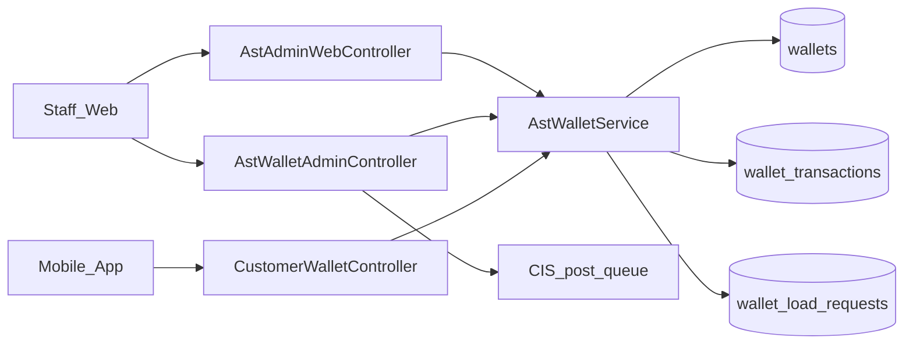
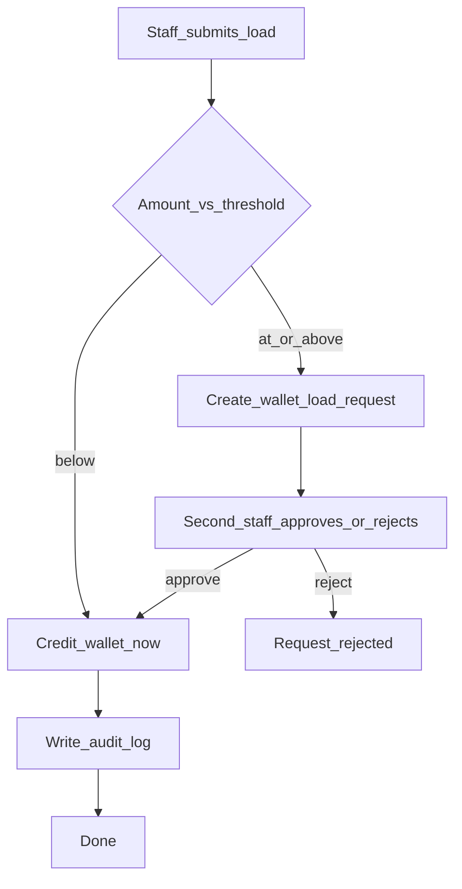
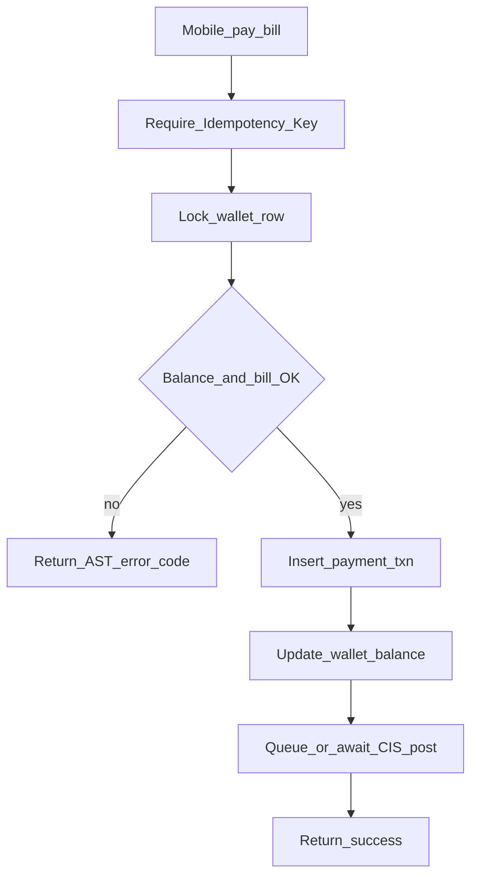

# Web — AST Wallet (ASELCO Token)

## Purpose

Closed-loop internal credit for members. **1 AST ≈ ₱1** (`config/ast.php` → `php_per_ast`). Staff load AST onto a customer wallet; members spend AST to pay electric bills from mobile. Loads at or above the approval threshold use maker-checker. Bill payments can be posted to CIS via a staff queue.

Not cash, not withdrawable, not transferable between customers. One wallet per member (`users.id`), even if they have multiple electric accounts.

AST exists so ASELCO can offer prepaid-style bill settlement without treating tokens as bank money. Staff control supply through load (and optional adjust) paths; members only debit via pay-bill. That split keeps treasury-like operations on the Blade admin surface while spend UX lives on mobile.

Web admin and admin API call the same domain services (`AstWalletService`, ledger helpers). Mobile never talks to CIS directly: it hits `/api/v1/customer/wallet/*`, and staff later post queued payments from `/ast/cis-queue`. Concurrency and audit rules are stricter than typical CRUD — see the deeper table contract linked below.

Deeper table/concurrency contract: [aselcoph/docs/ast-wallet-architecture.md](../../aselcoph/docs/ast-wallet-architecture.md).

## Deeper explanation

- **Key concepts:** Wallet balance is the source of truth for spendable AST; `wallet_transactions` are the audit trail; `wallet_load_requests` hold pending maker-checker loads; CIS queue is an ops follow-up after a successful mobile pay, not part of the debit itself.
- **Invariants:** No peer-to-peer transfer; one wallet per user; pay-bill requires an Idempotency-Key; loads at/above `AST_LOAD_APPROVAL_THRESHOLD` must not credit until a second staffer approves; prefer Phase-1 `Wallet*` models over legacy `AstWallet*` / `AstLedgerEntry*` paths.
- **Common pitfalls:** Treating AST like withdrawable cash in copy or product rules; skipping row locks / idempotency on pay; inventing alternate balance math outside `AstWalletService`; posting CIS before the wallet debit succeeds; mixing legacy Ast* tables with Phase-1 wallet tables in new code.

## Users / entry points

| Who | Where |
|-----|--------|
| Staff with wallet load rights | Side menu → AST admin (`/ast/admin/dashboard`, `/ast/admin/load`) |
| Staff (read / CIS) | `/ast/wallet`, `/ast/cis-queue` |
| Approvers | `/ast/admin/load-requests` |
| Members | Mobile wallet + Pay (see [mobile AST](../mobile/ast-wallet.md), [Pay](../mobile/pay-with-ast.md)) |

## Context diagram

## Process flowchart — load AST (maker-checker)

## Process flowchart — pay bill with AST

## File map (MVC + Services + AI)

| Layer | Path |
|-------|------|
| Controllers (web) | `aselcoph/app/Http/Controllers/AstAdminWebController.php` |
| | `aselcoph/app/Http/Controllers/AstWalletAdminController.php` |
| Controllers (API) | `aselcoph/app/Http/Controllers/Api/Admin/AdminWalletController.php` |
| | `aselcoph/app/Http/Controllers/Api/V1/CustomerWalletController.php` |
| | `aselcoph/app/Http/Controllers/Api/V1/WalletController.php` |
| | `aselcoph/app/Http/Controllers/Api/V1/LedgerController.php` (billing ledger, related) |
| Models | `Wallet.php`, `WalletTransaction.php`, `WalletLoadRequest.php`, `WalletAuditLog.php` |
| | Legacy/first-pass: `AstWallet.php`, `AstLedgerEntry.php`, `AstAuditLog.php` (prefer Phase-1 Wallet* tables) |
| Services | `aselcoph/app/Services/AstWalletService.php` |
| | `aselcoph/app/Services/WalletLedgerService.php` |
| Views | `aselcoph/resources/views/pages/staff/ast/*` |
| | `aselcoph/resources/views/pages/staff/ast-cis-queue.blade.php` |
| Config | `aselcoph/config/ast.php` |
| AI | None directly |

## Routes / API

### Web

| Method | Path | Name / notes |
|--------|------|----------------|
| GET | `/ast/admin/dashboard` | `ast.admin.dashboard` |
| GET/POST | `/ast/admin/load` | Load form / submit |
| POST | `/ast/admin/adjust` | Adjustment |
| GET/POST | `/ast/admin/request` | Support load request |
| GET | `/ast/admin/load-requests` | Maker-checker queue |
| POST | `/ast/admin/load-requests/{id}/approve\|reject` | Approve / reject |
| GET | `/ast/admin/customer/{userId}` | Customer wallet detail |
| GET | `/ast/wallet` | Wallet admin show |
| POST | `/ast/load` | Load shortcut |
| GET | `/ast/cis-queue` | CIS posting queue |
| POST | `/ast/payments/{id}/post-cis` | Post payment to CIS |

### API (`/api/v1`)

| Method | Path | Notes |
|--------|------|--------|
| GET | `/customer/wallet/balance` | Mobile primary |
| GET | `/customer/wallet/transactions` | Mobile primary |
| POST | `/customer/wallet/pay-bill` | Requires Idempotency-Key |
| GET | `/wallet`, `/wallet/transactions` | Alternate wallet API |
| POST | `/wallet/pay` | Alternate pay |
| GET/POST | `/admin/wallet/*` | Admin load / approve (`can.load-wallet`) |

## Permissions / feature flags

| Key | Source |
|-----|--------|
| `wallet.view`, `wallet.load`, `wallet.approve`, `wallet.transactions.view`, `wallet.audit.view` | `config/access.php` |
| Middleware `can.load-wallet` | Admin wallet API |
| `AST_PHP_RATE` | Rate (default 1) |
| `AST_LOAD_APPROVAL_THRESHOLD` | Default 10000 AST |
| `AST_MAX_LOAD_AMOUNT` | Cap |
| `AST_LOAD_WALLET_ROLES` | Roles allowed to load |

## Scenarios

### Scenario A — Staff loads below approval threshold

- **Actor:** Staff with `wallet.load`
- **Steps:**
  1. Open `/ast/admin/load` and select the member.
  2. Enter an amount under `AST_LOAD_APPROVAL_THRESHOLD`.
  3. Submit the load.
- **Expected result:** Wallet is credited immediately; a transaction and audit entry appear; no pending load request.
- **Where in code:** `AstAdminWebController` → `AstWalletService`; views under `pages/staff/ast/*`; config `config/ast.php`.

### Scenario B — Large load requires maker-checker

- **Actor:** Loader + second-staff approver (`wallet.approve`)
- **Steps:**
  1. Loader submits a load at or above the threshold.
  2. Approver opens `/ast/admin/load-requests`.
  3. Approver approves (or rejects) the request.
- **Expected result:** On approve, balance increases and audit is written; on reject, balance unchanged and request marked rejected. Same staffer should not both make and check when policy forbids it.
- **Where in code:** Load-request routes on `AstAdminWebController`; models `WalletLoadRequest`, `WalletAuditLog`; middleware/permissions `wallet.approve`.

### Scenario C — Member pays a bill with AST

- **Actor:** Mobile member
- **Steps:**
  1. App calls `POST /api/v1/customer/wallet/pay-bill` with Idempotency-Key.
  2. Service locks wallet, validates balance and bill, inserts payment txn, updates balance.
  3. Staff later posts to CIS from `/ast/cis-queue` if needed.
- **Expected result:** Debit succeeds once; retries with the same key do not double-charge; CIS post is a separate staff action.
- **Where in code:** `CustomerWalletController` → `AstWalletService`; CIS via `AstWalletAdminController` / `ast-cis-queue.blade.php`.

## Developer discussion

- Does this change keep all balance mutations inside `AstWalletService` (or documented ledger helpers), with no ad-hoc SQL in controllers?
- Are maker-checker, max load, and permission checks covered for amounts around `AST_LOAD_APPROVAL_THRESHOLD`?
- For pay-bill: is Idempotency-Key enforced, and what happens on concurrent double-submit?
- Could this PR write or “fix” historical `wallet_transactions` rows instead of appending?
- Security: who can `wallet.approve` / `can.load-wallet`, and can a loader self-approve?

## Related modules

- [Mobile AST Wallet](../mobile/ast-wallet.md)
- [Mobile Pay with AST](../mobile/pay-with-ast.md)
- [Consumers / Billing](consumers-billing.md) — account + bill data
- [Ledger (mobile)](../mobile/ledger.md)
- [Dashboard](dashboard.md)
