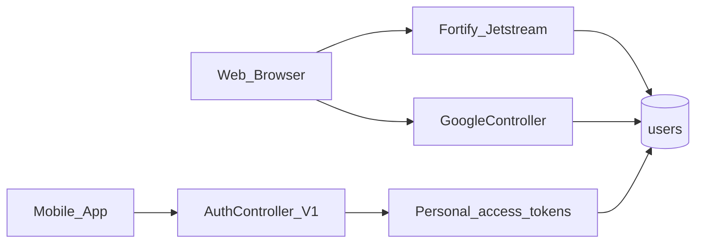
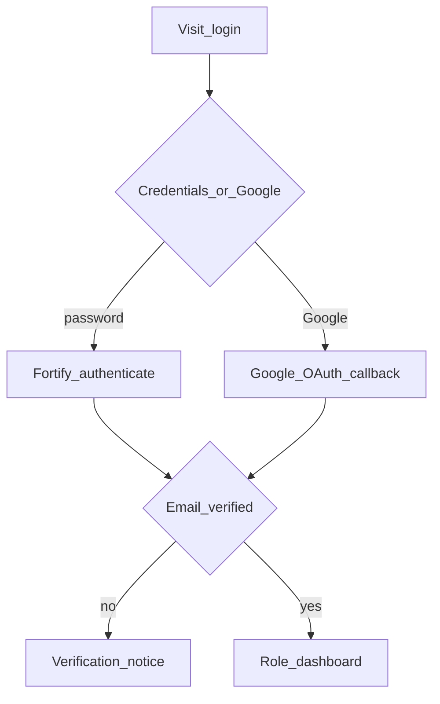

# Web — Auth & Profile

## Purpose

Staff and customer web authentication via Laravel Fortify/Jetstream (login, register, email verify, 2FA, profile). Google OAuth is available for web. Mobile uses a separate Sanctum token API (`Api/V1/AuthController`) documented under [mobile Auth](../mobile/auth.md).

Auth is the front door for both portals, but the session model differs: web relies on Fortify/Jetstream cookies/sessions (plus optional Google OAuth and 2FA); mobile uses personal access tokens from `/api/v1/auth/*`. Both ultimately bind to `users`. Profile management on web is Jetstream’s `/user/profile`; mobile uses `/auth/user` and related membership flows.

Access defaults (`ACCESS_DEFAULT_ROLE`) and optional staff MFA (`ACCESS_MFA_STAFF`) connect this module to User Management. Do not reuse mobile token issuance for Blade pages or put Google OAuth secrets in the mobile app — keep providers under `aselcoph/app/Providers/` and `Auth/GoogleController.php`.

## Deeper explanation

- **Key concepts:** Fortify/Jetstream feature flags; email verification gate; Google OAuth callback linking/creating users; Sanctum PATs for mobile; logout vs logout-all on API.
- **Invariants:** Unverified web users hit verification notice before role dashboards; mobile bearer tokens are revoked on logout/logout-all as implemented; Google callback only on web routes `/auth/google*`.
- **Common pitfalls:** Sharing one login UX assumption across web and mobile; disabling Jetstream 2FA/verify in config without updating ops runbooks; creating users in OAuth without the intended default role; treating API `/user` as a place to dump staff permission matrices (use Access APIs for that).

## Users / entry points

| Who | Where |
|-----|--------|
| Staff / customers (web) | Jetstream login, `/user/profile` |
| Google users | `/auth/google`, `/auth/google/callback` |
| Email verify | `/email/verify*` |
| Mobile members | `/api/v1/auth/*` |

## Context diagram

## Process flowchart — web login

## File map (MVC + Services + AI)

| Layer | Path |
|-------|------|
| Controllers | `Auth/GoogleController.php`, `Api/V1/AuthController.php` |
| Providers | Jetstream/Fortify service providers under `aselcoph/app/Providers/` |
| Models | `User.php` (+ Jetstream traits) |
| Views | Jetstream views under `resources/views` (auth, profile, 2FA) |
| Services / AI | None dedicated |

## Routes / API

### Web

| Path | Notes |
|------|--------|
| Fortify/Jetstream routes | Login, register, password, 2FA, profile |
| `/auth/google`, `/auth/google/callback` | Google OAuth |
| `/email/verify`, `/email/verify/{id}/{hash}` | Verification |
| `/user/profile` | Profile |

### API (`/api/v1/auth`)

| Method | Path |
|--------|------|
| POST | `/register`, `/login` |
| POST | `/logout`, `/logout-all` (auth) |
| GET | `/user` (auth) |
| POST | `/email/resend` |

## Permissions / feature flags

- Jetstream features in `config/jetstream.php` / Fortify
- Access default role on register: `ACCESS_DEFAULT_ROLE`
- Optional `ACCESS_MFA_STAFF`

## Scenarios

### Scenario A — Staff password login with verification

- **Actor:** Staff or customer web user
- **Steps:**
  1. Visit login; submit credentials via Fortify.
  2. If email unverified, land on verification notice / resend.
  3. After verify, reach role dashboard.
- **Expected result:** Session established only when Fortify + verification rules pass.
- **Where in code:** Fortify/Jetstream providers and views; dashboard routing after login.

### Scenario B — Google OAuth on web

- **Actor:** Web user
- **Steps:**
  1. Hit `/auth/google`.
  2. Complete provider consent; return on `/auth/google/callback`.
  3. Land verified/dashboard path per account state.
- **Expected result:** User linked/created in `users`; no mobile token issued from this path.
- **Where in code:** `Auth/GoogleController.php`.

### Scenario C — Mobile register/login/logout

- **Actor:** Mobile member
- **Steps:**
  1. `POST /api/v1/auth/register` or `/login`.
  2. Call `GET /auth/user` with bearer token.
  3. `POST /logout` or `/logout-all`.
- **Expected result:** PAT issued and later revoked as designed; web session untouched.
- **Where in code:** `Api/V1/AuthController.php`; Sanctum personal access tokens.

## Developer discussion

- Web vs mobile: are you changing the correct stack (Fortify session vs Sanctum PAT)?
- Default role / MFA env flags: regression impact on new registrations and staff login?
- Email verification and `/email/resend` still enforced where product requires it?
- Google OAuth: account takeover cases (email already registered) handled safely?
- Do not break: `/user/profile` Jetstream flows and mobile logout-all for stolen-device response.

## Related modules

- [Mobile Auth](../mobile/auth.md)
- [Access / User Management](access-user-management.md)
- [Dashboard](dashboard.md)
- [Membership (mobile)](../mobile/membership.md)
