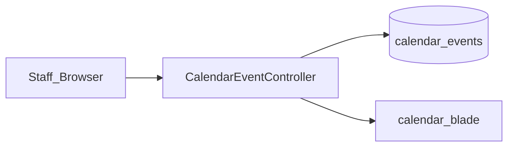
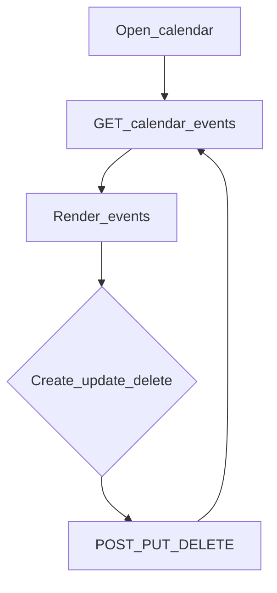

# Web — Calendar

## Purpose

Staff calendar for internal activities/events (create, update, delete). Simple CRUD over `CalendarEvent` — not customer-facing on mobile.

The calendar gives authenticated staff a shared place for internal schedules (meetings, field ops notes, coop events) without standing up a separate SaaS calendar. It is intentionally thin: one controller, one model, Blade UI plus JSON endpoints for the same events.

There is no `/api/v1` calendar surface for members. If product later needs member-visible schedules, that would be a new contract — do not overload this staff CRUD. Auth is session-based via the Jetstream/Sanctum verified web group; there is no fine-grained `calendar.*` code in `config/access.php` beyond login.

## Deeper explanation

- **Key concepts:** `CalendarEvent` rows; `/calendar` view; `/calendar-events` JSON CRUD for the UI.
- **Invariants:** Staff-only; mutations are ordinary REST-ish POST/PUT/DELETE on `/calendar-events/{event}`; no mobile consumer API.
- **Common pitfalls:** Assuming role-based calendar ACLs that do not exist; exposing events on public routes; adding heavy business logic in the Blade instead of keeping CRUD clear; coupling ticket SLAs to calendar events without an explicit design.

## Users / entry points

| Who | Where |
|-----|--------|
| Authenticated staff | `/calendar` UI, `/calendar-events` JSON |

## Context diagram

## Process flowchart

## File map (MVC + Services + AI)

| Layer | Path |
|-------|------|
| Controller | `aselcoph/app/Http/Controllers/CalendarEventController.php` |
| Model | `aselcoph/app/Models/CalendarEvent.php` |
| Views | `aselcoph/resources/views/pages/staff/calendar.blade.php` |
| Services / AI | None dedicated |

## Routes / API

| Method | Path |
|--------|------|
| GET | `/calendar` (`calendar.view`) |
| GET | `/calendar-events` |
| POST | `/calendar-events` |
| PUT | `/calendar-events/{event}` |
| DELETE | `/calendar-events/{event}` |

No mobile `/api/v1` calendar endpoints.

## Permissions / feature flags

Authenticated session (`auth:sanctum` + Jetstream verified group in `web.php`). No separate access module code beyond login.

## Scenarios

### Scenario A — Staff creates an event

- **Actor:** Authenticated staff
- **Steps:**
  1. Open `/calendar`.
  2. Create via UI → `POST /calendar-events`.
  3. Confirm event appears after `GET /calendar-events` refresh.
- **Expected result:** New `CalendarEvent` persisted and rendered.
- **Where in code:** `CalendarEventController`; `calendar.blade.php`; model `CalendarEvent`.

### Scenario B — Update and delete

- **Actor:** Authenticated staff
- **Steps:**
  1. Select an existing event.
  2. `PUT /calendar-events/{event}` with changes.
  3. `DELETE /calendar-events/{event}` when done.
- **Expected result:** Updates persist; delete removes from subsequent GETs.
- **Where in code:** Same controller/model routes as above.

### Scenario C — Unauthenticated or mobile client

- **Actor:** Anonymous browser or mobile app
- **Steps:**
  1. Attempt `/calendar` without session.
  2. Search for `/api/v1` calendar endpoints (none).
- **Expected result:** Web redirects/denies per auth middleware; mobile has no calendar API.
- **Where in code:** `web.php` auth group; absence of calendar routes in `api.php`.

## Developer discussion

- If adding ACLs, will you introduce real `config/access.php` codes instead of implicit “any logged-in staff”?
- Validation: date ranges, required fields, XSS in event titles/descriptions?
- Is JSON and Blade still sharing one controller path without divergent rules?
- Do not accidentally publish calendar routes outside the authenticated group.
- Keep mobile free of this module unless product explicitly adds a v1 contract.

## Related modules

- [Dashboard](dashboard.md)
- [Support Workspace](support-workspace.md)
