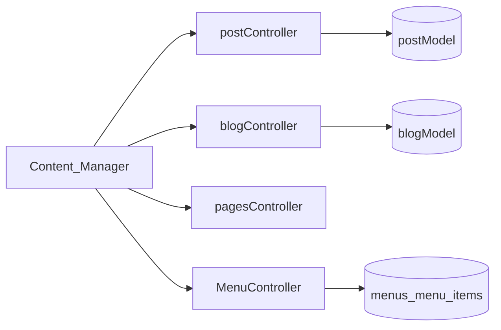
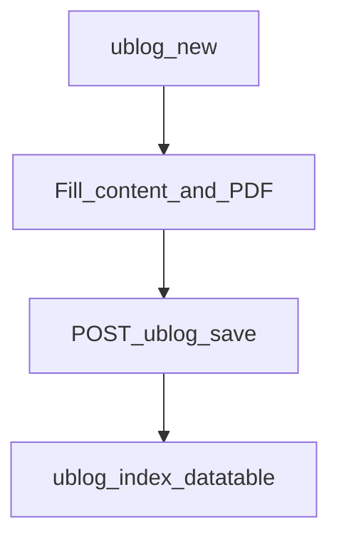

# Web — CMS / Blog / Pages (legacy, still routed)

## Purpose

Internal content management for articles (`ublog`), static pages, and menu builder. Still used by the **Content Manager** role menu; blog links are often commented out of the main admin menu but routes remain active.

CMS/blog predates the ticket/AI/knowledge stack and still serves coop content and static pages (`/page/about-us`, `/page/history`, public blog URLs). Content Managers edit via `/ublog`, `/pages`, and `/menus`. It is web-centric legacy MVC (`postController`, `blogController`, …) — not part of the mobile `/api/v1` product surface.

Treat changes carefully: naming is inconsistent (`postModel` / `blogModel`), and access is role-menu based (`components/menu/cms.blade.php`) rather than fine-grained `config/access.php` codes. Prefer not to invent a second CMS; if you only need policy Q&A for the assistant, use Knowledge/RAG instead.

## Deeper explanation

- **Key concepts:** ublog articles (including PDF fields in the publish flow); static pages; menus / menu-items builder; public read URLs vs editor URLs.
- **Invariants:** Routes remain even when admin menu links are commented out; Content Manager menu is the primary gate; public `/blog/{id}/{slug}` and `/page/*` are intentionally reachable without staff session (as routed today).
- **Common pitfalls:** “Cleaning up” by deleting routes still used in bookmarks; mixing Knowledge documents with ublog posts; assuming `config/access.php` module codes protect CMS writes; breaking menu builder JSON while editing Blade.

## Users / entry points

| Who | Where |
|-----|--------|
| Content Manager | `/ublog`, `/pages`, `/menus`, menu builder |
| Public (limited) | `/blog/{id}/{slug}`, `/page/about-us`, `/page/history` |

## Context diagram

## Process flowchart — publish article

## File map (MVC + Services + AI)

| Layer | Path |
|-------|------|
| Controllers | `postController.php`, `blogController.php`, `pagesController.php` |
| | `MenuController.php`, `MenuItemController.php` |
| Models | `postModel.php`, `blogModel.php`, `Menu.php`, `MenuItem.php` |
| Views | `resources/views/cms/`, `pages/page/`, `components/menu/cms.blade.php` |
| Services / AI | None |

## Routes

| Area | Paths |
|------|--------|
| Blog posts | `/ublog`, `/ublog/new`, `/ublog/edit/{id}`, save/update |
| Pages | `/pages`, `/pages/new`, public `/page/*` |
| Menus | `/menus`, builder, `menu-items/*` |
| Admin blog create | `/admin/new-blog` |

## Permissions / feature flags

Role-based Content Manager menu (`components/menu/cms.blade.php`), not fine-grained `config/access.php` module codes.

## Scenarios

### Scenario A — Content Manager publishes ublog article

- **Actor:** Content Manager
- **Steps:**
  1. Open `/ublog/new` from CMS menu.
  2. Fill content (and PDF if used); save.
  3. Confirm row in `/ublog` datatable; optional public `/blog/{id}/{slug}`.
- **Expected result:** Article stored via post/blog controllers/models; listed for editors.
- **Where in code:** `postController` / `blogController`; views under `resources/views/cms/`.

### Scenario B — Edit static page

- **Actor:** Content Manager
- **Steps:**
  1. Open `/pages` / `/pages/new` as needed.
  2. Update about/history style content.
  3. View public `/page/about-us` or `/page/history`.
- **Expected result:** Public page reflects save; no staff session required on public GET.
- **Where in code:** `pagesController`; `pages/page/` views.

### Scenario C — Menu builder change

- **Actor:** Content Manager
- **Steps:**
  1. Open `/menus` and builder / `menu-items/*`.
  2. Add or reorder items; save.
  3. Verify rendered menus for affected roles/pages.
- **Expected result:** `Menu` / `MenuItem` persistence; CMS menu component still loads.
- **Where in code:** `MenuController`, `MenuItemController`; `components/menu/cms.blade.php`.

## Developer discussion

- Is this change truly CMS, or should it live in Knowledge/RAG / Announcements instead?
- Public vs editor routes: any new write endpoint left unauthenticated?
- Role menu gate only — acceptable risk, or should this move to `config/access.php`?
- File/PDF uploads: storage path and validation consistent with File Manager expectations?
- Do not remove routed `/ublog` or `/page/*` paths without a redirect/content migration plan.

## Related modules

- [File Manager](file-manager.md) — media storage overlap
- [Dashboard](dashboard.md)
