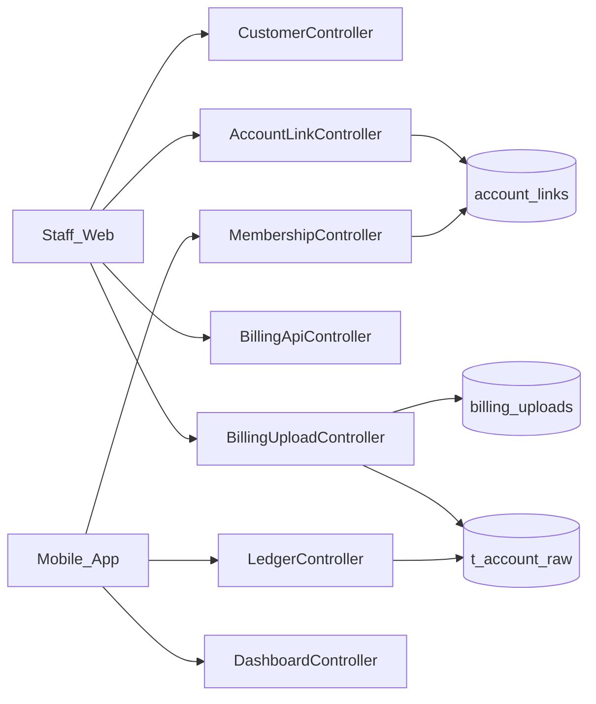
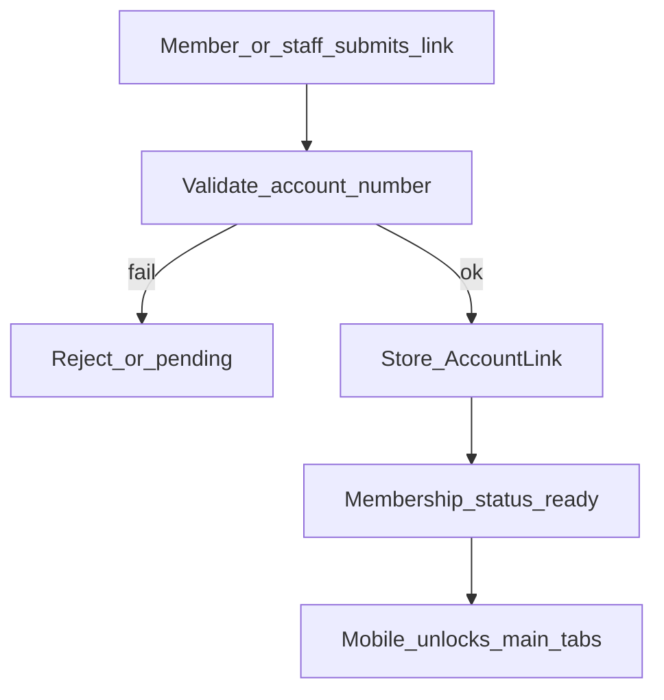
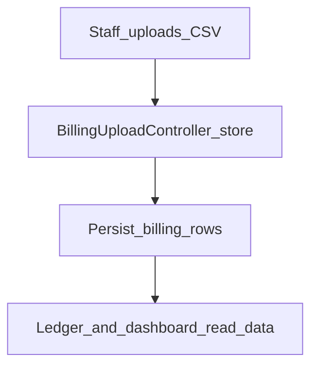

# Web — Consumers, Account Linking & Billing

## Purpose

Link electric service accounts to app users, validate account requests, upload billing CSV data, and manage the consumer list. This data powers mobile membership gating, dashboard balances, ledger history, and AST bill pay matching.

Without a verified account link, mobile membership stays gated and wallet pay cannot reliably match a bill to a member. Staff own validation and CSV billing upload on web; members complete linking flows on mobile (and some customer web registration paths). Billing rows (`t_account_raw` / uploads) feed ledger and dashboard summary APIs — they are not edited from the mobile client.

Treat this module as shared master data between Access customer lists, AST pay, and Home/Ledger. Prefer existing controllers (`CustomerController`, `AccountLinkController`, `BillingUploadController`, membership/ledger/dashboard API controllers) over parallel stores. Legacy complaint pages may still sit nearby but tickets are the modern case system.

## Deeper explanation

- **Key concepts:** Consumer/customer records; account validation; `AccountLink` as the user↔service-account bridge; billing CSV upload into raw/upload tables; membership status as the mobile gate; ledger/dashboard as read models over billing + links.
- **Invariants:** A usable membership requires successful/approved links per product rules; billing upload is staff-only; mobile ledger/dashboard are read APIs; AST pay must resolve bills against linked accounts/billing data, not invent account numbers client-side.
- **Common pitfalls:** Approving links without validation; uploading CSV with silent parse failures; assuming `/consumer/list` is CIS source of truth; mixing legacy `/complaints/*` into new ticket work.

## Users / entry points

| Who | Where |
|-----|--------|
| Staff | `/access/customers`, `/access/customers/{id}`, `/validation`, `/billing-upload` |
| Customer web | `/customer/registration`, complaint pages |
| Members (mobile) | Membership setup + Profile linked accounts |
| Billing ops | `/t/dashboard` (billing upload dashboard) |

## Context diagram

## Process flowchart — link account

## Process flowchart — billing upload

## File map (MVC + Services + AI)

| Layer | Path |
|-------|------|
| Controllers | `CustomerController.php`, `AccountLinkController.php` |
| | `BillingUploadController.php`, `BillingApiController.php` |
| | `CustomerComplaintController.php` (legacy complaints) |
| | API: `Api/V1/MembershipController.php`, `DashboardController.php`, `LedgerController.php` |
| Models | `AccountLink.php`, `MemberProfile.php`, `TAccountRaw.php`, `BillingUpload.php`, `CustomerComplaint.php` |
| Services | `MemberProfileService.php`; other domain logic in controllers + wallet/ledger services for pay |
| Views | `pages/customer/*`, `pages/staff/accounts.blade.php`, complaint/validation blades |
| AI | None |

## Routes / API

### Web

| Path | Notes |
|------|--------|
| `/access/customers`, `/access/customers/{id}` | Portal members + personal information |
| `/access/customers/{id}/membership-application` | Print / Save as PDF application form |
| `/customer/registration`, `/customer/store` | Customer registration |
| `/validation`, `/api/account/validation*` | Account validation |
| `/billing-upload` | CSV upload UI |
| `/fetch-billing` | Billing API fetch |
| `/complaints/*`, `/complaint` | Legacy complaint UI |

### API (`/api/v1`)

| Path | Notes |
|------|--------|
| `/membership/status`, `/privacy`, `/account-links`, `/profile`, `/linked-accounts` | Mobile gate |
| `/dashboard/summary` | Home balances |
| `/ledger` | Billing history |

## Permissions / feature flags

- `customers.*`, `billing.view` in `config/access.php`

## Scenarios

### Scenario A — Staff validates and links an account

- **Actor:** Staff with customer/billing access
- **Steps:**
  1. Review pending validation under `/validation` (or related account APIs).
  2. Confirm account number against billing/consumer data.
  3. Store/approve `AccountLink`.
- **Expected result:** Membership status becomes ready for that member; mobile unlocks gated tabs.
- **Where in code:** `AccountLinkController`, `MembershipController`; model `AccountLink`.

### Scenario B — Billing CSV upload

- **Actor:** Billing ops staff
- **Steps:**
  1. Open `/billing-upload` (and/or `/t/dashboard`).
  2. Upload CSV; confirm parse/persist.
  3. Spot-check mobile `/ledger` and `/dashboard/summary` for a linked account.
- **Expected result:** Rows in billing upload / `t_account_raw`; read APIs reflect new data.
- **Where in code:** `BillingUploadController`, `BillingApiController`; models `BillingUpload`, `TAccountRaw`.

### Scenario C — Member completes membership on mobile

- **Actor:** Mobile member
- **Steps:**
  1. Submit account link / privacy, then personal information via membership APIs.
  2. Poll `/membership/status`.
  3. Once ready, Home uses `/dashboard/summary` and ledger history.
- **Expected result:** Gate lifts only when links validate; pay/ledger use the same linked accounts.
- **Where in code:** `MembershipController`, `DashboardController`, `LedgerController`.

### Scenario D — Staff prints a membership application

- **Actor:** Staff or support with `customers.view`
- **Steps:**
  1. Open **User Management → Customers** (`/access/customers`) or **Members → Customers** on the support menu.
  2. Open the member detail.
  3. Review **Membership application** (address, civil status, contact, seminar date).
  4. Click **Print / Save as PDF** to open the official application form filled with the member’s data. Fill Membership O.R.#, date issued, and area manager on the print page if needed, then print.
- **Expected result:** The paper form matches `docs/aselco_membership_application.html`, with member-submitted fields prefilled.
- **Where in code:** `AccessUserWebController::membershipApplication`; view `pages/staff/access/membership-application.blade.php`.

## Developer discussion

- Does account validation still run before `AccountLink` becomes membership-ready?
- CSV upload failure modes: partial writes, duplicate accounts, bad rows — how are they surfaced?
- Permissions: `customers.*` / `billing.view` on new staff routes?
- Cross-module: will AST pay-bill and dashboard summary still resolve the same account identifiers?
- Do not treat legacy `/complaints/*` as the path for new request/complaint features (use Tickets).

## Related modules

- [Mobile Membership](../mobile/membership.md)
- [Mobile Ledger](../mobile/ledger.md)
- [AST Wallet](ast-wallet.md)
- [Access / User Management](access-user-management.md)
- [Dashboard](dashboard.md)
