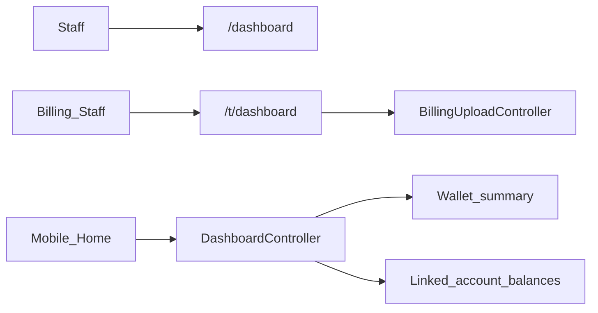
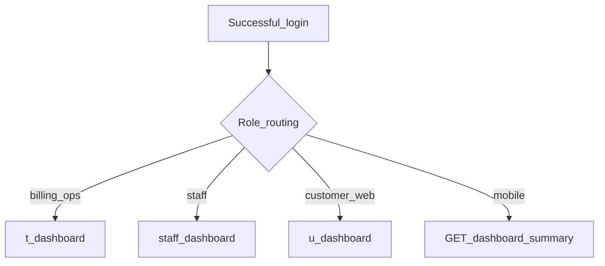

# Web — Dashboard

## Purpose

Role-based home after login. Staff land on general or billing dashboards; customers get a simpler home. Mobile Home uses `GET /api/v1/dashboard/summary` instead of Blade.

Dashboards orient users after auth: staff see operational entry points, billing ops get `/t/dashboard` tied to upload workflows, and customer web may use `/u/dashboard`. Mobile never renders these Blade pages — it consumes a JSON summary that aggregates wallet and linked-account billing signals for the Home tab.

Keep role routing explicit in `web.php` / post-login redirects. The API summary should remain a read model over wallet + consumers/billing data, not a place to embed ticket queues or AI chat. Permission `dashboard.view` gates staff visibility where the access catalog applies.

## Deeper explanation

- **Key concepts:** Post-login role routing; staff Blade dashboards; billing upload dashboard (`BillingUploadController::dashboard`); mobile summary API.
- **Invariants:** Mobile Home depends on `/api/v1/dashboard/summary`; web dashboards stay session-authenticated; summary should not mutate wallet or billing data.
- **Common pitfalls:** Returning staff-only fields on the mobile summary; breaking `/t/dashboard` when refactoring billing upload; hard-coding role names in multiple places instead of one redirect strategy; assuming one Blade template serves all roles.

## Users / entry points

| Who | Where |
|-----|--------|
| Authenticated users | `/dashboard` |
| Billing staff | `/t/dashboard` (`BillingUploadController::dashboard`) |
| Users (alt) | `/u/dashboard` |
| Members (mobile) | Home tab via dashboard summary API |

## Context diagram

## Process flowchart

## File map (MVC + Services + AI)

| Layer | Path |
|-------|------|
| Controllers | Closure routes in `web.php`; `BillingUploadController::dashboard` |
| | `Api/V1/DashboardController.php` |
| Views | `dashboard.blade.php`, `pages/staff/dashboard.blade.php`, `pages/staff/index.blade.php` |
| Models / services | Pulls wallet + billing-linked data for API summary |
| AI | None |

## Routes / API

| Path | Notes |
|------|--------|
| `GET /dashboard` | Default post-login |
| `GET /t/dashboard` | Billing upload dashboard |
| `GET /u/dashboard` | Alternate user dashboard |
| `GET /api/v1/dashboard/summary` | Mobile Home |

## Permissions / feature flags

- `dashboard.view` in access catalog
- Auth middleware group in `web.php`

## Scenarios

### Scenario A — Staff lands on general dashboard

- **Actor:** Authenticated staff
- **Steps:**
  1. Log in via Fortify/Jetstream.
  2. Redirect to `/dashboard` (or role-specific staff view).
  3. Navigate to modules from menus.
- **Expected result:** Correct Blade home for role; unauthorized modules hidden by access menus.
- **Where in code:** `web.php` closures; `pages/staff/dashboard.blade.php` / `index.blade.php`.

### Scenario B — Billing ops dashboard

- **Actor:** Billing staff
- **Steps:**
  1. Open `/t/dashboard`.
  2. Use billing upload related actions from that surface.
- **Expected result:** BillingUpload dashboard loads; ties to consumers/billing upload flows.
- **Where in code:** `BillingUploadController::dashboard`.

### Scenario C — Mobile Home summary

- **Actor:** Mobile member with membership
- **Steps:**
  1. Authenticate with Sanctum.
  2. `GET /api/v1/dashboard/summary`.
  3. Home renders wallet + linked account balances from payload.
- **Expected result:** Read-only summary; empty/zero states when no links/wallet.
- **Where in code:** `Api/V1/DashboardController.php`; wallet + billing-linked reads.

## Developer discussion

- Did post-login redirects for each role stay correct after your change?
- Mobile summary: additive fields only, backward compatible with the Home tab?
- Any mutation accidentally added to a dashboard GET?
- Permission `dashboard.view` vs auth-only routes — consistent with menus?
- Do not break: `/t/dashboard` billing ops path and `/api/v1/dashboard/summary` contract.

## Related modules

- [Consumers / Billing](consumers-billing.md)
- [AST Wallet](ast-wallet.md)
- [Mobile Home](../mobile/home-dashboard.md)
- [Auth & Profile](auth-profile.md)
