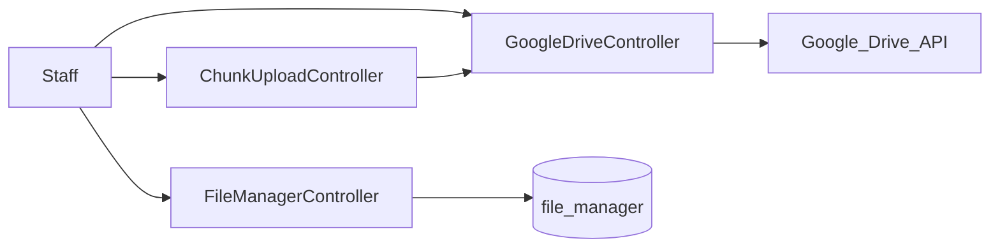
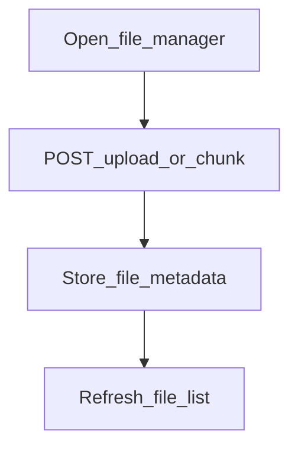

# Web — File Manager / Google Drive (ops legacy)

## Purpose

Internal file storage UI with folders, upload, rename, soft-delete, plus Google Drive helpers and chunked upload. Used for ops/content workflows; not part of the mobile customer app.

File Manager fills the gap between Blade CMS/content work and ad-hoc shared drives: staff upload and organize files in-app, or push large files through chunked upload into Google Drive when configured. It is an authenticated staff ops tool — members do not call these routes from Ionic.

Ticket attachments and knowledge documents use their own storage paths; do not assume File Manager is the universal binary store. Drive features depend on Google credentials in env; without them, local file-manager routes may still work while `/google-drive*` / `/drive/*` fail.

## Deeper explanation

- **Key concepts:** Local `file_manager` metadata; folder tree; soft-delete; Google Drive activate/UI; chunked upload for large payloads.
- **Invariants:** Staff session required; mobile `/api/v1` is out of scope; ticket attachments remain on the tickets module path; Drive ops go through `GoogleDriveController` / `ChunkUploadController`.
- **Common pitfalls:** Treating soft-delete as hard purge; mixing Drive file IDs with local `FileManager` rows; exposing list/upload APIs without auth; using File Manager for member PII that should live in ticket-secure storage.

## Users / entry points

| Who | Where |
|-----|--------|
| Staff | `/file-manager/*`, `/google-drive`, `/drive/*` |

## Context diagram

## Process flowchart — upload

## File map (MVC + Services + AI)

| Layer | Path |
|-------|------|
| Controllers | `FileManagerController.php`, `ChunkUploadController.php`, `GoogleDriveController.php` |
| Model | `FileManager.php` |
| Views | `modules/file-manager/`, `pages/filemanager/` |
| Services / AI | None dedicated |

## Routes

| Path | Notes |
|------|--------|
| `/file-manager/*` | List, upload, folder, rename, destroy, API files |
| `/file-manager/v2/list` | Demo list |
| `/google-drive`, `/google-drive-actived` | Drive UI / activate |
| `/drive/folder/create`, `/drive/file/upload`, `/drive/storage` | Drive ops |
| `/drive/file/upload-chunk` | Chunked upload |

## Permissions / feature flags

Authenticated staff session; Google Drive credentials via env.

## Scenarios

### Scenario A — Local upload and organize

- **Actor:** Authenticated staff
- **Steps:**
  1. Open file manager UI under `/file-manager/*`.
  2. Upload a file; optionally create folder / rename.
  3. Soft-delete if needed; confirm list refresh.
- **Expected result:** `FileManager` metadata stored; file list updates; soft-delete hides without necessarily purging storage immediately as implemented.
- **Where in code:** `FileManagerController`; views `modules/file-manager/`, `pages/filemanager/`.

### Scenario B — Chunked Google Drive upload

- **Actor:** Staff with Drive configured
- **Steps:**
  1. Activate/open `/google-drive` as required.
  2. Upload via `/drive/file/upload-chunk` (and related `/drive/*` ops).
  3. Confirm Drive storage/folder create paths succeed.
- **Expected result:** Chunks assemble remotely; failures surface when credentials/env missing.
- **Where in code:** `ChunkUploadController`, `GoogleDriveController`.

### Scenario C — Not for tickets or mobile

- **Actor:** Developer integrating attachments
- **Steps:**
  1. Check tickets attachment flow vs file-manager routes.
  2. Confirm no mobile API client points at `/file-manager/*`.
- **Expected result:** Ticket binaries stay on ticket storage; mobile unaffected.
- **Where in code:** Tickets module attachment controllers; absence of file-manager in mobile API clients.

## Developer discussion

- Auth on every list/upload/destroy route — any new public leak?
- Soft-delete vs hard delete and storage cleanup jobs?
- Drive credentials: fail closed with clear errors when env missing?
- MIME/size validation and path traversal on rename/folder APIs?
- Do not route ticket or member document uploads through this legacy manager without a security review.

## Related modules

- [CMS / Blog](cms-blog.md)
- [Tickets](tickets.md) — ticket attachments use separate storage path
