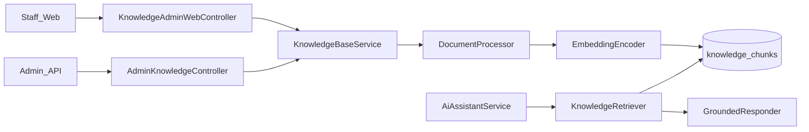
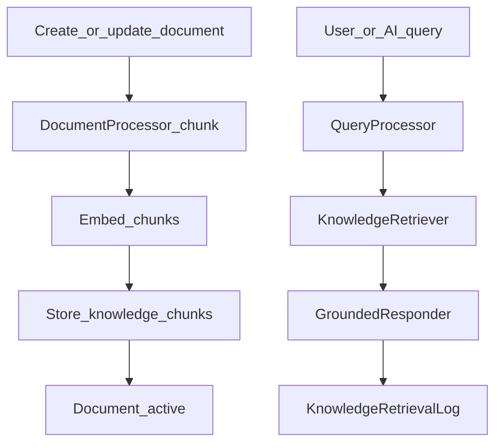

# Web — Knowledge Base / RAG

## Purpose

Staff manage approved knowledge documents and categories, chunk/embed them, and retrieve them so AI answers stay grounded in ASELCO policy and how-to content. Includes a staff test/chat UI to validate retrieval before customers see answers in the mobile assistant.

Without this module, the assistant would answer from model priors only. Knowledge/RAG is the editorial control plane: who can publish, what is active, how documents are reindexed, and how retrieval is tested. It is staff-web and admin-API facing; members never manage documents — they only consume grounded answers through AI.

Fit in the stack: Blade under `/knowledge/*` (middleware `can.manage-tickets`) and `/api/v1/admin/knowledge` feed `KnowledgeBaseService` / `DocumentProcessor`. At query time, `AiAssistantService` calls `KnowledgeRetriever` → `GroundedResponder`. Config lives in `config/rag.php`; seed content under `database/seeders/knowledge-base/**`.

## Deeper explanation

- **Key concepts:** Documents and versions; categories; chunks with embeddings; active/publish toggles; retrieval logs for debugging; test/chat UIs as pre-prod validation, not a second product channel.
- **Invariants:** Inactive documents should not ground customer answers; reindex rebuilds chunks/embeddings rather than leaving stale vectors; retrieval logging (`KnowledgeRetrievalLog`) should remain available for “why did it say that?” investigations; mobile has no separate knowledge CRUD API.
- **Common pitfalls:** Editing text in DB without reindex; pointing AI at unapproved drafts; changing chunk/embed settings in `config/rag.php` without reprocessing existing docs; treating `/knowledge/chat` as a replacement for production customer AI authZ.

## Users / entry points

| Who | Where |
|-----|--------|
| Knowledge / ticket admins | `/knowledge`, `/knowledge/documents` |
| Editors | Create/edit/toggle/reindex documents |
| Testers | `/knowledge/test`, `/knowledge/chat` |
| AI runtime | Called from `AiAssistantService` / grounded responder (no separate mobile UI) |

Middleware: `can.manage-tickets` on `/knowledge/*`.

## Context diagram

## Process flowchart — publish & retrieve

## File map (MVC + Services + AI)

| Layer | Path |
|-------|------|
| Controllers | `aselcoph/app/Http/Controllers/KnowledgeAdminWebController.php` |
| | `aselcoph/app/Http/Controllers/Api/Admin/AdminKnowledgeController.php` |
| Models | `KnowledgeDocument.php`, `KnowledgeDocumentVersion.php`, `KnowledgeChunk.php` |
| | `KnowledgeCategory.php`, `KnowledgeRetrievalLog.php` |
| Services (`Services/Rag/`) | `KnowledgeBaseService.php`, `KnowledgeRetriever.php` |
| | `DocumentProcessor.php`, `EmbeddingEncoder.php` |
| | `GroundedResponder.php`, `QueryProcessor.php`, `RetrievalHit.php` |
| AI consumer | `Services/Ai/AiAssistantService.php` |
| Views | `aselcoph/resources/views/pages/staff/knowledge/*` |
| Config | `aselcoph/config/rag.php` |
| Seed content | `aselcoph/database/seeders/knowledge-base/**` |

## Routes / API

### Web (`knowledge.*`)

| Path | Action |
|------|--------|
| `GET /knowledge` | Dashboard |
| `GET/POST /knowledge/documents` | List / create |
| `GET/PUT /knowledge/documents/{id}` | Show / update |
| `POST .../toggle`, `.../reindex` | Activate / re-embed |
| `GET/POST /knowledge/categories` | Categories |
| `GET\|POST /knowledge/test`, `/knowledge/chat` | Retrieval testing |

### API (`/api/v1/admin/knowledge`)

| Method | Path |
|--------|------|
| GET/POST | `/` |
| GET/PUT/POST/DELETE | `/{id}` |
| POST | `/{id}/index` |
| GET | `/categories` |
| POST | `/search` |

## Permissions / feature flags

| Key | Notes |
|-----|--------|
| `knowledge.view/create/edit/delete/publish/index` | `config/access.php` |
| `ai.knowledge.manage` | AI-side knowledge management |
| RAG settings | `config/rag.php` (chunk size, embedding provider, etc.) |

## Scenarios

### Scenario A — Publish a new knowledge document

- **Actor:** Knowledge editor with create/publish rights
- **Steps:**
  1. Create document under `/knowledge/documents`.
  2. Assign category; save content.
  3. Index/reindex and toggle active/publish as required.
- **Expected result:** Chunks embedded and stored; document eligible for retrieval when active.
- **Where in code:** `KnowledgeAdminWebController` → `KnowledgeBaseService` / `DocumentProcessor` / `EmbeddingEncoder`.

### Scenario B — Staff validates retrieval before go-live

- **Actor:** Tester / knowledge admin
- **Steps:**
  1. Open `/knowledge/test` or `/knowledge/chat`.
  2. Run representative member questions.
  3. Inspect hits / logs; adjust document or reindex if weak.
- **Expected result:** Grounded answers or clear empty-hit behavior; logs in `KnowledgeRetrievalLog` for debugging.
- **Where in code:** Knowledge admin views; `QueryProcessor`, `KnowledgeRetriever`, `GroundedResponder`.

### Scenario C — Customer AI uses indexed knowledge

- **Actor:** Mobile member (indirect)
- **Steps:**
  1. Member chats via customer AI API.
  2. `AiAssistantService` retrieves chunks for the query.
  3. Completion uses grounded context when hits exist.
- **Expected result:** Answer reflects approved docs; inactive docs not used.
- **Where in code:** `AiAssistantService` → `KnowledgeRetriever` → chunks table.

## Developer discussion

- After content edits, is reindex (`.../reindex` or API `/{id}/index`) required and documented in the PR?
- Do permission codes (`knowledge.*` vs `ai.knowledge.manage`) match the routes you added?
- How do inactive/unpublished documents behave in `KnowledgeRetriever` — regression test?
- Changing `config/rag.php` chunk/embed settings: migration plan for existing `knowledge_chunks`?
- Security: admin knowledge APIs must not be callable with only a member Sanctum token.

## Related modules

- [AI Assistant](ai-assistant.md)
- [Tickets](tickets.md)
- [Mobile AI Assistant](../mobile/ai-assistant.md) — consumes grounded answers
