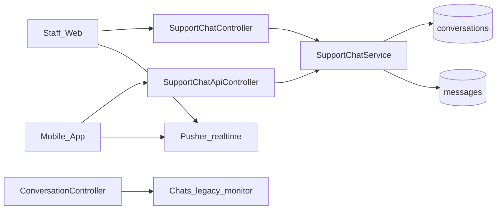
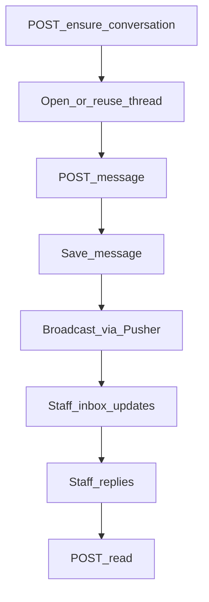

# Web — Support Chat

## Purpose

Human customer↔staff support chat shared by staff Blade UI and the mobile app. One conversation model is served through `SupportChatService` and `SupportChatApiController`. A legacy staff chat monitor (`ConversationController`, older `Supp*` models) still exists for internal/monitoring paths.

This is separate from the [AI Assistant](ai-assistant.md) channel.

Support chat exists so members can reach a live agent without mixing AI transcripts into the same thread model. Staff work from `/chats` / `/chats/support`; members use mobile `/support/chat`. Realtime delivery depends on Pusher/broadcasting auth; persistence still goes through `SupportChatService` into conversation/message tables.

Prefer the modern Chats models (`Models/Chats/Conversation`, `Message`, …) and `SupportChatService` for new features. Treat `Supp*` controllers/models and `/chats/monitor` as legacy/monitor surfaces — do not fork business rules into both stacks without an explicit migration plan.

## Deeper explanation

- **Key concepts:** Ensure-conversation (open or reuse thread); inbox + unread totals for staff badges; message send/read receipts; attachments/pins/reactions on the modern models; Pusher for fan-out after persist.
- **Invariants:** One logical customer support thread per ensure rules (reuse, don’t spam new conversations); staff API under `/support/chat/*` gated with `can.manage-tickets`; member paths under `/customer/support-chat/*`; AI assistant remains a parallel channel.
- **Common pitfalls:** Broadcasting before persist; reading legacy `Supp*` tables from new mobile clients; forgetting `{origin}/broadcasting/auth`; conflating `chat.view` menu access with ticket-manage API middleware.

## Users / entry points

| Who | Where |
|-----|--------|
| Support staff | `/chats`, `/chats/support`, inbox + unread totals |
| Monitors | `/chats/monitor` |
| Members | Mobile `/support/chat` |
| Permission | `chat.view` |

## Context diagram

## Process flowchart — customer message

## File map (MVC + Services + AI)

| Layer | Path |
|-------|------|
| Controllers | `aselcoph/app/Http/Controllers/Chats/SupportChatController.php` |
| | `aselcoph/app/Http/Controllers/Chats/ConversationController.php` |
| | `aselcoph/app/Http/Controllers/Chats/MessagesController.php` |
| | `aselcoph/app/Http/Controllers/Api/V1/SupportChatApiController.php` |
| Legacy | `SuppChatController.php`, `SuppMessageController.php` |
| Models | `Models/Chats/Conversation.php`, `Message.php`, `Attachment.php` |
| | `ConversationParticipant.php`, `MessagePin.php`, `MessageReaction.php` |
| | Legacy: `SuppConversation.php`, `SuppMessage.php`, `SuppParticipant.php`, `SuppAttachment.php` |
| Services | `aselcoph/app/Services/SupportChatService.php` |
| Views | `aselcoph/resources/views/modules/chats/support.blade.php` |
| | `aselcoph/resources/views/modules/chats/*`, `supp_chat/*` |
| AI | None (human channel only) |

## Routes / API

### Web

| Path | Notes |
|------|--------|
| `GET /chats`, `/chats/support` | Staff UI |
| `POST /chats/support/ensure` | Ensure thread |
| `GET /chats/support/inbox` | Inbox |
| `GET\|POST /chats/support/{conversation}/messages` | Messages |
| `POST /chats/support/{conversation}/read` | Mark read |
| `GET /chats/support/unread-total` | Badge |
| `GET /chats/monitor` | Legacy monitor |

### API (`/api/v1`)

| Path | Role |
|------|------|
| `/customer/support-chat/*` | Mobile member |
| `/support/chat/*` | Staff (`can.manage-tickets`) |
| `{origin}/broadcasting/auth` | Pusher auth |

## Permissions / feature flags

| Key | Notes |
|-----|--------|
| `chat.view` | Access support chat |
| `can.manage-tickets` | Staff support chat API |
| Pusher / broadcasting | App broadcasting config + mobile `realtime/supportPusher.ts` |

## Scenarios

### Scenario A — Member starts or resumes chat

- **Actor:** Mobile member
- **Steps:**
  1. App calls ensure-conversation on `/customer/support-chat/*`.
  2. Member sends a message.
  3. Message persists and broadcasts; staff inbox unread updates.
- **Expected result:** Existing open thread reused when ensure rules say so; staff sees the message without refresh if Pusher is healthy.
- **Where in code:** `SupportChatApiController` → `SupportChatService`; mobile realtime `supportPusher.ts`.

### Scenario B — Staff replies from Blade inbox

- **Actor:** Support staff with `chat.view`
- **Steps:**
  1. Open `/chats/support`, load inbox.
  2. Open conversation, POST message.
  3. Mark read; confirm unread-total drops.
- **Expected result:** Reply stored and pushed to member; badge counts consistent.
- **Where in code:** `SupportChatController`; views `modules/chats/support.blade.php`.

### Scenario C — Monitor vs modern stack

- **Actor:** Ops / supervisor using monitor
- **Steps:**
  1. Open `/chats/monitor` (legacy path).
  2. Compare with modern support inbox for the same period.
- **Expected result:** Monitor may use legacy models; do not assume feature parity with `SupportChatService`.
- **Where in code:** `ConversationController`, legacy `Supp*` models/views under `supp_chat/*`.

## Developer discussion

- Is all new message logic in `SupportChatService`, shared by web and API controllers?
- Ensure-conversation: what are the reuse rules, and did you add tests for double-ensure?
- Realtime: persist-then-broadcast order; broadcasting auth still required?
- Are you accidentally writing to `Supp*` tables from the mobile API?
- Permissions: `chat.view` for UI vs `can.manage-tickets` for staff API — both still correct?

## Related modules

- [Mobile Support Chat](../mobile/support-chat.md)
- [Tickets](tickets.md) — escalation from AI may create tickets; chat stays human
- [AI Assistant](ai-assistant.md) — parallel channel
- [Support Workspace](support-workspace.md)
