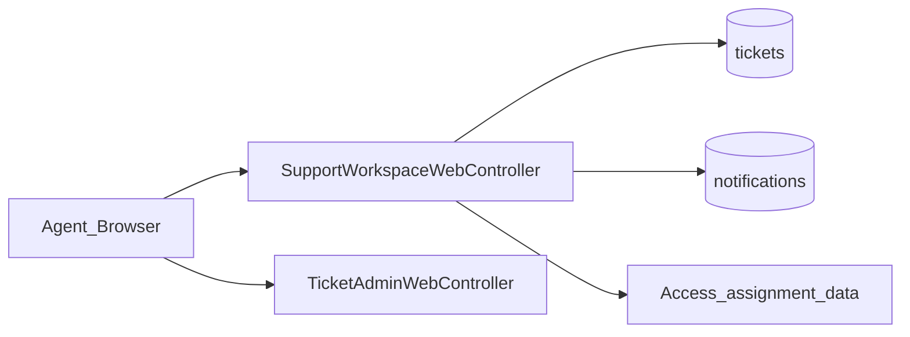
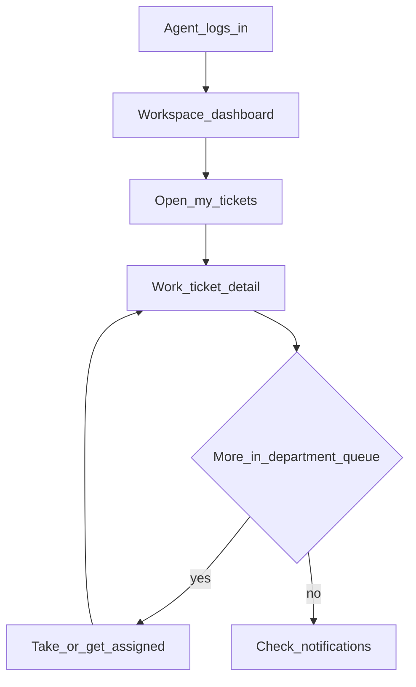

# Web — Support Workspace

## Purpose

Agent and supervisor working surface on top of tickets and notifications: my tickets, department queue, SLA view, and notification inbox. Requires `tickets.view` permission (`can.permission:tickets.view`).

Workspace is not a second ticket engine — it is a curated set of views over tickets, notifications, and access/assignment data so agents start from “what’s mine / what’s in my department” instead of the full admin queue every time. Detail work still deep-links into `TicketAdminWebController` flows.

Web routes live under `/workspace/*`. Agents also have API counterparts (`/api/v1/support/dashboard`, `/support/tickets`, `/support/notifications`) for non-Blade clients. Keep permission requirements aligned with Access and Tickets docs so a user who can open workspace can actually act on tickets they pick up.

## Deeper explanation

- **Key concepts:** Agent dashboard vs supervisor dashboard; my tickets vs department queue; SLA view as ops signal; notifications inbox as attention feed; availability/assignment data from Access.
- **Invariants:** Middleware `can.permission:tickets.view` on workspace routes; mutating ticket state still goes through ticket controllers/services, not ad-hoc workspace writes; supervisor views may show wider queues but must still respect escalate/reassign permissions on actions.
- **Common pitfalls:** Duplicating ticket lifecycle logic inside `SupportWorkspaceWebController`; showing tickets the agent cannot open; drifting Blade paths away from `pages/staff/access/*` support views; ignoring notification unread state that agents rely on.

## Users / entry points

| Who | Where |
|-----|--------|
| Support agents | `/workspace/dashboard`, `/workspace/tickets` |
| Supervisors | `/workspace/supervisor`, `/workspace/department-queue`, `/workspace/sla` |
| All ticket viewers | `/workspace/notifications` |

## Context diagram

## Process flowchart — agent day

## File map (MVC + Services + AI)

| Layer | Path |
|-------|------|
| Controller | `aselcoph/app/Http/Controllers/Access/SupportWorkspaceWebController.php` |
| Models | Uses `Ticket`, notifications, user availability (via Access) |
| Services | Relies on `TicketService`, `AccessService` / assignment helpers |
| Views | `pages/staff/access/support-dashboard.blade.php` |
| | `supervisor-dashboard.blade.php`, `ticket-dashboard.blade.php` |
| | `ticket-list.blade.php`, `notifications.blade.php` (under access views) |
| AI | Indirect — ticket AI from ticket detail |

## Routes / API

| Route | Name |
|-------|------|
| `GET /workspace/dashboard` | `workspace.dashboard` |
| `GET /workspace/supervisor` | `workspace.supervisor` |
| `GET /workspace/tickets` | `workspace.tickets` |
| `GET /workspace/department-queue` | `workspace.department` |
| `GET /workspace/sla` | `workspace.sla` |
| `GET /workspace/notifications` | `workspace.notifications` |

API counterpart: `/api/v1/support/dashboard`, `/support/tickets`, `/support/notifications`.

## Permissions / feature flags

- Middleware: `can.permission:tickets.view`
- Related: `tickets.*`, `notifications.view`, availability settings in `config/access.php`

## Scenarios

### Scenario A — Agent works “my tickets”

- **Actor:** Support agent with `tickets.view`
- **Steps:**
  1. Open `/workspace/dashboard` then `/workspace/tickets`.
  2. Open a ticket (detail via ticket admin flow).
  3. Progress/close per ticket permissions.
- **Expected result:** List scoped to the agent’s assignments; detail actions still permission-checked.
- **Where in code:** `SupportWorkspaceWebController`; views `support-dashboard.blade.php`, `ticket-list.blade.php`; `TicketService` on mutations.

### Scenario B — Supervisor reviews department queue and SLA

- **Actor:** Supervisor
- **Steps:**
  1. Open `/workspace/supervisor` and `/workspace/department-queue`.
  2. Check `/workspace/sla` for at-risk items.
  3. Reassign/escalate using ticket tools as needed.
- **Expected result:** Wider queue visibility; actions still go through ticket permission codes.
- **Where in code:** Supervisor/department/SLA routes; Access assignment helpers; ticket reassign/escalate.

### Scenario C — Notification inbox triage

- **Actor:** Any ticket viewer
- **Steps:**
  1. Open `/workspace/notifications`.
  2. Follow through to the related ticket or item.
  3. Confirm API `/support/notifications` stays consistent if used by clients.
- **Expected result:** Notifications surface actionable work without inventing a parallel ticket store.
- **Where in code:** `notifications.blade.php`; support notifications API.

## Developer discussion

- Is this PR only changing presentation/query filters, or is it duplicating ticket write logic?
- Do agent vs supervisor views enforce the same `tickets.*` action permissions on deep-links?
- Availability / max workload from Access: still respected when picking from department queue?
- API parity: `/api/v1/support/*` vs Blade workspace — intentional differences documented?
- Do not break: route names `workspace.*`, menu links, and ticket detail navigation.

## Related modules

- [Tickets](tickets.md)
- [Access / User Management](access-user-management.md)
- [Support Chat](support-chat.md)
- [Announcements](announcements.md)
