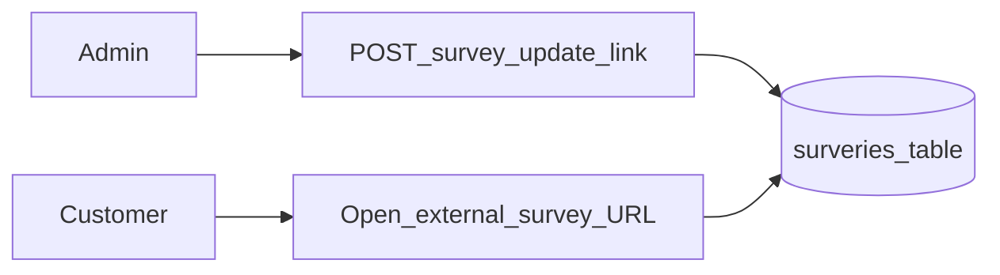
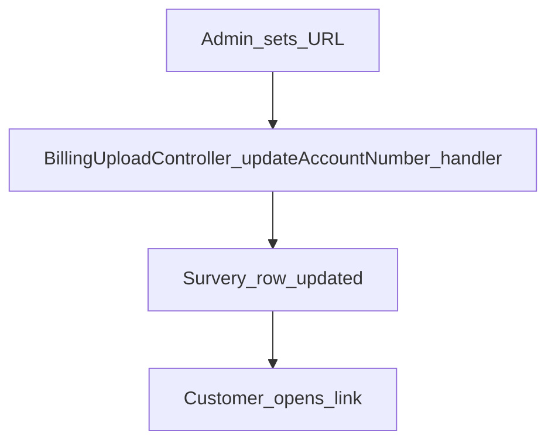

# Web — Satisfaction Survey

## Purpose

Stores and updates an external satisfaction survey URL (model name is historically misspelled `Survery`). Admin can update the link; customer menu opens the URL. Not a full survey engine inside the app.

This module exists as a lightweight pointer: ASELCO can change the third-party survey destination without a mobile/app store release. Admins set the URL from the admin menu Swal; customers open whatever is currently stored. There is no question bank, response analytics, or `/api/v1` survey API in this doc’s scope.

Be careful with the wiring: `POST /survey/update-link` is routed to `BillingUploadController::updateAccountNumber` in `web.php`. That historical coupling is easy to break when refactoring billing upload. Prefer fixing the route target deliberately over “cleaning” billing methods without checking survey behavior.

## Deeper explanation

- **Key concepts:** Single stored external URL; admin update POST; customer menu link-out; misspelled `Survery` model / `surveries` table naming.
- **Invariants:** App does not host survey questions; changing the link should not require schema beyond the Survery row; customer only needs read of the configured URL.
- **Common pitfalls:** “Fixing” the BillingUploadController method and silently breaking survey updates; renaming the model without migrations/aliases; building a full survey product on this table without a new design; assuming fine-grained access codes exist (role menu visibility only).

## Users / entry points

| Who | Where |
|-----|--------|
| Admin | Swal/UI in admin menu → `POST /survey/update-link` |
| Customer (web) | Customer menu opens configured survey link |

## Context diagram

## Process flowchart

Note: the update route is wired to `BillingUploadController::updateAccountNumber` in `web.php` (`POST /survey/update-link`) — verify behavior when changing survey storage.

## File map (MVC + Services + AI)

| Layer | Path |
|-------|------|
| Model | `aselcoph/app/Models/Survery.php` |
| Controller hook | `BillingUploadController` (route target for update) |
| UI | Admin menu Swal in `components/menu/admin.blade.php`; customer menu link |
| Services / AI | None |

## Routes

| Method | Path |
|--------|------|
| POST | `/survey/update-link` |

## Permissions / feature flags

Admin menu visibility by role.

## Scenarios

### Scenario A — Admin updates survey URL

- **Actor:** Admin (menu-visible role)
- **Steps:**
  1. Open admin menu survey Swal (`components/menu/admin.blade.php`).
  2. Submit new URL to `POST /survey/update-link`.
  3. Confirm `Survery` row updated.
- **Expected result:** Stored URL changes; no in-app survey pages created.
- **Where in code:** Route → `BillingUploadController::updateAccountNumber`; model `Survery.php`.

### Scenario B — Customer opens survey

- **Actor:** Customer web user
- **Steps:**
  1. Use customer menu survey entry.
  2. Browser opens the external URL from storage.
- **Expected result:** External site loads; app does not collect answers locally.
- **Where in code:** Customer menu link reading configured URL / `Survery` model.

### Scenario C — Billing upload refactor risk

- **Actor:** Developer changing billing upload
- **Steps:**
  1. Inspect `web.php` for `/survey/update-link` target.
  2. Change or rename `updateAccountNumber` only with a survey regression check.
  3. Prefer dedicating a clear controller method if decoupling.
- **Expected result:** Survey update still works after billing changes; intentional decoupling documented.
- **Where in code:** `web.php` route binding; `BillingUploadController`.

## Developer discussion

- If you touch `BillingUploadController::updateAccountNumber`, did you verify `/survey/update-link`?
- URL validation (https only, length, XSS in admin display)?
- Is role-menu gating enough, or should this move under Access permissions?
- Renaming `Survery` / `surveries`: migration + code aliases plan?
- Do not build response storage into this table without a proper survey product design.

## Related modules

- [Dashboard](dashboard.md)
- [Auth & Profile](auth-profile.md)
