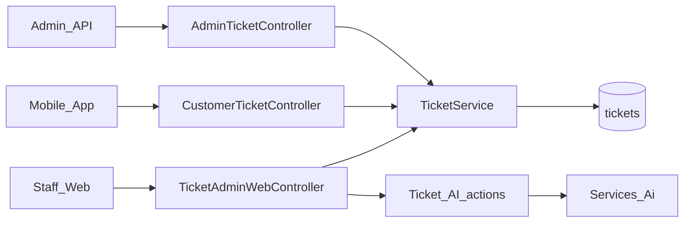
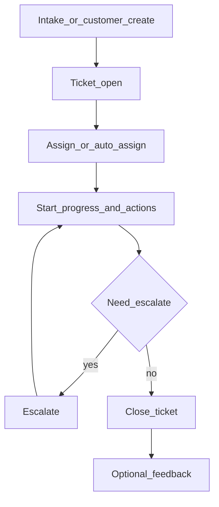

# Web — Tickets (Complaints & Requests)

## Purpose

Staff-facing ticket queue for customer complaints and service requests: intake, assign/reassign, progress actions, escalate, close, attachments, feedback, and reports. Replaces or supplements the older `CustomerComplaint` flow. Mobile customers create and track tickets via `/api/v1/customer/tickets`.

Ticket AI (analyze priority, suggest replies) is documented under [AI Assistant](ai-assistant.md) but invoked from ticket screens.

Tickets are the operational spine for member issues that need a human owner, SLA visibility, and an auditable action history. Intake can start on web (staff on behalf of a caller) or on mobile (member self-serve); both converge on `TicketService` and the same `tickets` tables so status, assignment, and attachments stay consistent.

Web owns the full lifecycle UI under `/tickets/*` (middleware `can.manage-tickets`). Mobile and admin APIs mirror create/list/show and selected actions. Legacy `CustomerComplaint` / `CustomerComplaintController` may still appear in older menus — prefer the Ticket models for new work, and use import helpers only when migrating history.

## Deeper explanation

- **Key concepts:** Ticket as the case record; actions and status history as the timeline; categories for routing; escalations for supervisor paths; attachments and feedback as optional edges; AI analysis/drafts are assistive, not auto-close.
- **Invariants:** Assignment and reassignment should leave history (`TicketAssignmentHistory`); close is a terminal (or near-terminal) staff action; customer API must not expose staff-only escalate/reassign without proper gates; auto-assign strategy comes from config (`TICKET_AUTO_ASSIGN_STRATEGY`, `ACCESS_AI_ASSIGNMENT`), not hard-coded agent IDs in controllers.
- **Common pitfalls:** Building new flows against legacy complaints only; mutating status without writing action/history rows; letting AI apply priority without an explicit staff confirm path; forgetting attachment download auth on `TicketAttachmentDownloadController`.

## Users / entry points

| Who | Where |
|-----|--------|
| Ticket-capable staff | `/tickets` queue, `/tickets/intake` |
| Supervisors | Escalations, reports, reassign |
| Agents via workspace | [Support Workspace](support-workspace.md) |
| Members | Mobile Tickets / Complaints |

Middleware: `can.manage-tickets` on `/tickets/*`.

## Context diagram

## Process flowchart — staff lifecycle

## File map (MVC + Services + AI)

| Layer | Path |
|-------|------|
| Controllers (web) | `aselcoph/app/Http/Controllers/TicketAdminWebController.php` |
| Controllers (API) | `aselcoph/app/Http/Controllers/Api/Admin/AdminTicketController.php` |
| | `aselcoph/app/Http/Controllers/Api/V1/CustomerTicketController.php` |
| | `aselcoph/app/Http/Controllers/Api/V1/TicketAttachmentDownloadController.php` |
| Legacy | `aselcoph/app/Http/Controllers/CustomerComplaintController.php` |
| Models | `Ticket.php`, `TicketAction.php`, `TicketAttachment.php`, `TicketCategory.php` |
| | `TicketEscalation.php`, `TicketFeedback.php`, `TicketStatusHistory.php`, `TicketAssignmentHistory.php` |
| | `TicketAiAnalysis.php`, `TicketAiResponseDraft.php` |
| | Legacy: `CustomerComplaint.php` |
| Services | `aselcoph/app/Services/TicketService.php` |
| | `aselcoph/app/Services/LegacyComplaintImportService.php` |
| | AI: `Services/Ai/TicketAiAnalyzer.php`, `TicketAiResponseAssistant.php` |
| Views | `aselcoph/resources/views/pages/staff/tickets/*` |
| Config | `aselcoph/config/tickets.php` |
| Jobs | `aselcoph/app/Jobs/AnalyzeTicketWithAiJob.php` |

## Routes / API

### Web (`/tickets/*`, `tickets.*`)

| Path | Action |
|------|--------|
| `GET /tickets` | Queue |
| `GET/POST /tickets/intake`, `POST /tickets` | Intake / store |
| `GET /tickets/{id}` | Detail |
| `POST /tickets/{id}/start\|actions\|escalate\|close\|reassign\|attachments\|feedback` | Lifecycle |
| `GET /tickets/escalations`, `/reports`, `/notifications` | Ops |
| `GET /tickets/ai` + `POST /tickets/{id}/ai/*` | AI (see AI doc) |

### API (`/api/v1`)

| Path | Role |
|------|------|
| `/customer/tickets` | Mobile create/list/show/feedback/attachments |
| `/admin/tickets/*` | Staff API mirror |
| `/tickets/attachments/{attachment}` | Download |

## Permissions / feature flags

| Key | Notes |
|-----|--------|
| `tickets.view/create/edit/assign/reassign/escalate/close/export` | `config/access.php` |
| `complaints.view/create` | Legacy complaints |
| Middleware `can.manage-tickets` | Web + many admin APIs |
| Assignment strategy | `TICKET_AUTO_ASSIGN_STRATEGY`, `ACCESS_AI_ASSIGNMENT` in `config/access.php` |

## Scenarios

### Scenario A — Staff intake and close

- **Actor:** Ticket-capable staff
- **Steps:**
  1. Open `/tickets/intake`, create the ticket, and submit.
  2. Assign (or accept auto-assign), start progress, add actions.
  3. Close the ticket; optionally capture feedback.
- **Expected result:** Ticket moves through open → in progress → closed with action/status history; appears in queue/reports.
- **Where in code:** `TicketAdminWebController` → `TicketService`; views `pages/staff/tickets/*`; `config/tickets.php`.

### Scenario B — Member creates a ticket from mobile

- **Actor:** Mobile member
- **Steps:**
  1. App creates via `/api/v1/customer/tickets`.
  2. Staff sees it in `/tickets` or workspace queues.
  3. Member later views status / adds feedback or attachments as allowed by API.
- **Expected result:** Same `Ticket` row as web intake; customer cannot reassign or escalate beyond API allowances.
- **Where in code:** `CustomerTicketController` → `TicketService`; attachment download via `TicketAttachmentDownloadController`.

### Scenario C — Escalate and use ticket AI assist

- **Actor:** Agent + supervisor; optional AI
- **Steps:**
  1. Agent escalates from ticket detail.
  2. Supervisor works escalations/reports views.
  3. Staff may run AI analyze / suggest-response from `/tickets/{id}/ai/*` and review drafts before sending.
- **Expected result:** Escalation recorded; AI outputs stored as analysis/draft, not silent status changes unless staff applies priority.
- **Where in code:** Escalation models + `TicketAiAnalyzer` / `TicketAiResponseAssistant`; job `AnalyzeTicketWithAiJob`.

## Developer discussion

- Are status transitions and assignment changes going through `TicketService` with history rows, not Blade-only updates?
- Which permission codes (`tickets.assign` vs `reassign` vs `escalate` vs `close`) does this PR touch, and are web + admin API aligned?
- Attachment upload/download: authZ checked for both staff and customer paths?
- If AI is involved: does apply-priority require an explicit POST, and is `AI_ENABLED` / throttle respected?
- What should QA not break: queue filters, workspace deep-links to ticket detail, legacy complaint import assumptions?

## Related modules

- [AI Assistant](ai-assistant.md)
- [Support Workspace](support-workspace.md)
- [Access / User Management](access-user-management.md) — assignable agents
- [Mobile Tickets](../mobile/tickets.md), [Complaints](../mobile/complaints.md)
- [Announcements](announcements.md)
